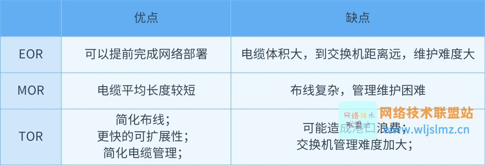

# HCIE-DC

## 云DC架构概述

南向接口————北向接口

IAN(智简网络)
智能化网络是一种趋势

运维通过网络收集数据，然后通过自动化管理分析网络配置网络

EOR
MOR
TOR
POD：一个业务一个POD或一个机柜一个POD

spine-leaf

onderlay:ECMP,ip
overlay

per-flow转发
per-packet转发

vlanif是一个广播域，bdif是一个广播域,是通过hash选路
VXLAN：子接口方式接入
       vlan接入

在接入层里面使用vlan把广播缩小，但vxlan却把广播调大，导致BD广播域在整个大二层里面泛洪，在数据中心，该如何调优呢？（降低防洪对开销的影响，而泛洪是由ARP引起的，所以主要是针对ARP，ARP代答，ARP抑制）

flooding

ARP：广播请求  FFFF
    单播响应   单播
    免费ARP    FFFF（地址重复检测）

VXLAN集中式网关:单点故障，ARP瓶颈，承载压力大 “U型”次优路径———>分布式网关 网关最多4K

集中式多活网关解决方案：两个spine网关，两个spine的回环地址一样并发布到underlay网络中，其实就是把两个spine虚拟成一个spine.这个网络中存在一个问题：网络中有两个业务分别是1.0和2.0业务，业务A访问业务B，到达spine1,spine1上没有业务2的mac地址，发送ARP请求记录该地址并把业务1的mac地址记录，然后通过spine1上的1.254发送给2.254,到达业务2.但当业务2访问业务1的时候，经由spine2访问spine1，但spine2上并没有业务1的mac地址。所以这就造成了一个很尴尬的事情，spine2又要发送ARP请求，思考一下，有没有一种可能有一种方法使mac地址同步呢，spine1学习到的地址共享给spine2。配置DFS.

如何实现1600w租户呢？
    vxlan vni = 2的24次方=1600w

线网中：分布式GW+EVPN+SDN

EVPN: IRB 对称型
          非对称型（简单）

虚拟SDN控制器：Mininet、OpenDayLight、ONOS

why say: SDN”已死“，SDN”永生“！！！
    https://baijiahao.baidu.com/s?id=1708513275330255439&wfr=spider&for=pc 

