[toc]


# OSPFV2
> Database Overflow -- Area 0默认认为20-default-route-advertise:下发缺省，条件本地全局路由表存在有效缺省路由-- always即便没有缺省，也可以下发【双出口】
路由过滤:3类、5类【产生的位置过滤】，过滤进程最佳路由【进程间依赖三类完成路由计算】，汇总过滤细化路由【必须存在细化路由触发，ABR上执行]
## 技术背景
*   技术背景:全网可达–路由自己只能发现直连路由–静态部署【浮动路由–边界环路_黑洞路由】  

*   1.易错、易漏、收敛不灵活【收敛:网络从变化到达稳定所用的时间】  

*   2.动态路由协议:路由发现–路由通告-路由计算–路由收敛  

*   3.IGP:内部网关路由协议--- AS【自治系统–校园网】  

*   4.距离矢量路由协议:RIP【跳数】–简单的矢量叠加–路由–成环路-最大跳数16  

*   链路状态路由协议:OSPF (Cost】- SPF计算:以自己为根进行SPF计算-LSA  

## OSPF基本信息：
* Router_ ID【手工指定_Loopback:本地环回地址–不死特性，与设备共存;自动选【Loopback -接口IP】
* Area 0【骨干区域-AR】---Area0【非骨干区域】【边界ABR_区域边界路由器】  

OSPF信息如何交流--报文类型和作用  

## OSPF 如何完成收敛?-- SPF计算
*   SPF计算-- LSA情况--LSDB-等待同步
## DR与BDR：
*   DR（Designated Router）即指定路由器，其负责在MA网络建立和维护邻接关系并负责LSA的同步。
*   DR与其他所有路由器形成邻接关系并交换链路状态信息，其他路由器之间不直接交换链路状态信息。这样就大大减少了MA网络中的邻接关系数量及交换链路状态信息消耗的资源。
*   DR一旦出现故障，其与其他路由器之间的邻接关系将全部失效，链路状态数据库也无法同步。此时就需要重新选举DR，再与非DR路由器建立邻接关系，完成LSA的同步。为了规避单点故障风险，通过选举备份指定路由器BDR，在DR失效时快速接管DR的工作。
*   伪节点是一个虚拟设备节点，其功能需要某台路由器来承载，下面将介绍DR/BDR的选举规则。
*   224.0.0.6--普通邻居关系224.0.0.5 ---报文定义DR身份--DR发起二类LSA 【Network)】


## DR与BDR的选举：
*   选举规则：DR/BDR的选举是基于接口的
*   接口的DR优先级越大越优先
*   接口的DR优先级相等时，RouterID越大越优先。
*   DR:指定路由器---BDR:备份指定路由器--DRother---一【广播域网络环境中】--比大【优先级-0不参与选举，默认1-接口IP)
*   稳定大于一切·继承关系【Full-接收到优先级更大或者Route ID更大信息–不变更】

## 泛洪机制
*   LSA泛洪机制【新旧辨别–唯一性确定–保留措施】--区域【一类/二类LSA本地区域泛洪】
*   1.LSA类型–链路状态ID–通告路由器ID【唯一确定一条LSA)】
*   2.新旧差别【接受新的LSA-序列号越大LSA越新序号+1- T=30min】
*   3.最大年龄3600s-需要被清除
*   一类LSA : Router LSA 在本区域内泛洪–描述本设备直连网段和直连拓扑信息--【设备自己产生自己通告】–有且只有一条
*   二类LSA: Network LSA 在本区域内泛洪–描还DR所在广播域邻居列表信息–【DR产生。描述邻居列表信息】–广播链路一条

## 影响OSPF邻接关系连理原因【1.状态--2.报文_参数--3.物理故障】
> 进程里面存放的是进程最佳路由–比较之后的结果【Cost 越小越优】
>讲程之间还需要比较优先级【全局路由表中存放的是本地全局有效最佳路由】
*   1.接口区域ID【脚本误刷，V-Link操作失误-- OSPF基于接口建立邻居】
*   2.Route-ID冲突【设备自主选择本地最优地址，如果做了虚拟化共享IP，小概率事件出现---脚本配置错误】
区域内-LSDB同步，影响路由–直连冲突，影响邻居建立【LSA头部包含Route-ID参数】
区域间-不引入路由，互不影响– LSDB数据库独立【引入外部路由–相互刷新–引起外部路由震荡】
*   3.掩码:P2P网络不扫描掩码–【PPP NCP网络层协商，网络参数匹配-- IPCP校验IP地址】
MA网络–掩码识别有效设备
*   4.认证【广域网链路跨越运营商-可靠性–接口、区域_密钥相同】
*   5.hello时间-4T
*   6.【特殊区域--NP位置位】-普通区域和特殊区域无法建立邻居_能够识别的LSA类型不同，LSA泛洪的区间不同
*   7.MTU异常:检查-Exchange状态
*   8.静默接口Silence【被动接口】--- 业务接口
*   9.MA网络优先级:默认优先级1，P2P网络优先级默认0，不参与DR/BDR选举
*   10.网络类型不一致
*   11.【策略，设备_FW，隧道_组播----接口接触不良，宕机，虚拟化环境引起的震荡】
   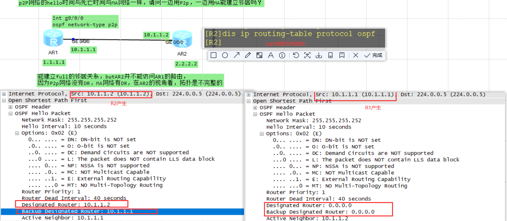

## lsa优先cost及防止环路
* LSA优选:一类-三类–五类【OE1 OE2】--- 3替5【IP网段包含关系下路由优化行为】--- IP规划
 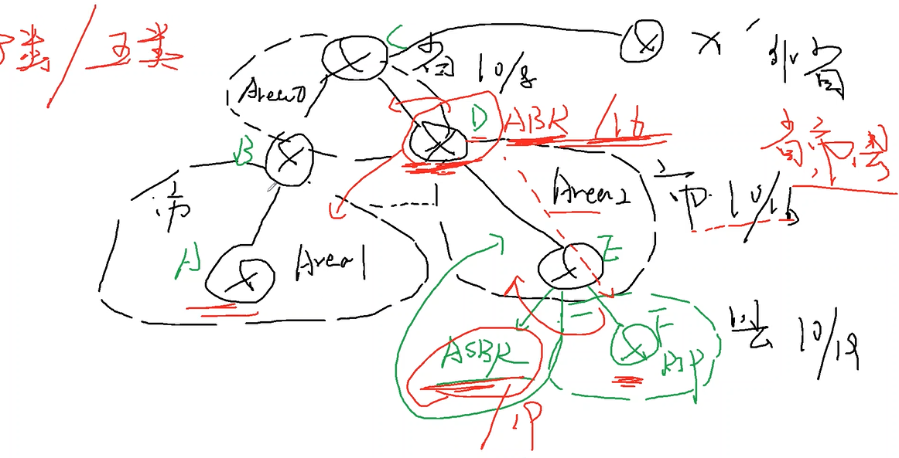
* 【一类不可以过滤–LSDB，三类五类描述路由信息】
* ost:带宽【10M = 100Mb/10_10,100M/1000M_1,E1 100Mb/2.04848---T1100Mb/1.566 64】--一条链路两端修改
* DSPF防止环路:区域内-SPF 区域间–普通区域必须和骨干区域相连–外部路由防止环路四类描述五类位置信息
## ospf多区域（三类LSA）

*   单区域问题:1.LSDB庞大不易于维护⒉.不能汇总3.设备压力非常大【成本高】

*   Aera 0:在生产环境建议值–阈值

*   多区域OSPF:1.每个区域维护自己独立的LSDB 
2.三类LSA:OSPF进程路由–新的始发者
3.设备采购根据区域需要计算SPF能力来考量–扩展

*   ABR:区域边界路由器【1.必须存在和Area 0 Full邻居关系⒉两个接口属于不同区域】–区域之间信使

*   三类LSA: ABR发起–通告进程最佳路由–区域间泛洪【网段/掩码/cost】

*   区域之间路由计算方式:简单的矢量叠加---类似RIP---易成环【避环–非骨干区域一定要和骨干区域相连】

*   **如果区域之间拓扑有环状，由于矢量叠加的计算方式，会由abr重新发起进程路由，失去对一手信息的掌握，故此成环,所以ABR的条件是必须存在和Area 0 Full邻居关系**
  

*   同源更新:无条件更新【同一个卖猪肉的涨价了，无条件信任】


*   非同源更新:越小越优先，没得比较就直接胜出【两个卖猪肉的，谁家便宜买谁家】


*   区域间汇总:1.细化路由触发·2.区域内部整理进程路由信息【ABR是新的路由产生者，所以允许汇总】…--IP地址规划时候要考虑后期汇总问题

*   区域间路由计算:1+3=区域内骨干一类LSA_ABR置位:找到ABR -由ABR发起的区域间路由信息【Cost】

## vlink
* V-Link :虚链路--1.网络设计不合理【骨干区域不够健壮】⒉故障导致骨干区域被分割---业务容灾【搭建临时链路】
* Peer 对等体-- Router-id
* 不足:1.无法汇总⒉环路??


## OSPF域外路由（四、五类LSA）
1. 五类LSA：
   * 概念：将其他协议的路由(静态路由)或者其他进程的路由(另一OSPF进程的路由)引入到本协议中，产生的路由称为外部路由
   * 泛洪范围：所有区域（ospf）
   * 引入后的路由在路由表显示为O_ASE，优先级为150
   * 设备可以同时称为ABR和ASBR
   * ASBR:ASBR负责生成5类LSA,ASBR:自治系统边界路由器---五类LSA-AS内泛洪–描述外部路由信息–发起者【允许路由汇总】ABR:四类LSA-描述五类LSA位置

      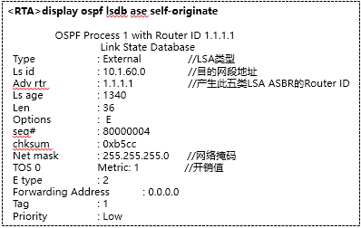
   * 五类LSA在区域泛洪时不会改变通告者和开销
   * 与ASBR不在一个区域的设备，需要通过4类LSA的辅助，进行访问对应外部路由
   * 防环措施：依靠三类四类LSA防环
   * E-type(华为默认为e2)
   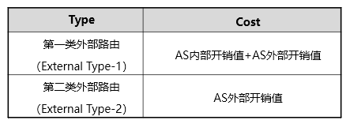
   * FA地址:为OSPF的ASBR去往外部路由的下一跳地址【描述存在条件三个】-防止次优【ASBR在MA网络】防止环路【普通区域五类优于特殊区域7类】
    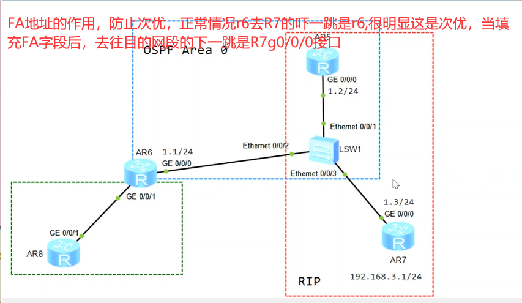
     * 1.外部路由接口必须存在于OSPF进程中
     * 2.不能是静默接口
     * 3.连接外部路由的网络类型不能是点对点

1. 四类LSA：
   * 功能：除了ASBR所在区域外，用于通告ASBR位置 
   * 特点：在穿越不同区域时，由新的ABR重新产生。（与3类LSA一致） 
   * 泛洪范围：区域间
   * 报文
   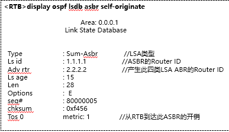


## 特殊区域
* 作用：缩减LSDB和路由表规模
* Stub:不允许引入外部路由，没有4类、5类，不存在ASBR，末节点ABR自动产生一条三类的缺省路由在本区域泛洪，用于访问外部网络
* totally Stub:不允许引入外部路由，没有4类、5类,不产生三类，末节点ABR自动产生一条三类的缺省路由在本区域泛洪，用于访问外部网络
* NSSA:允许引入外部路由，不允许其他产生的5类泛洪【完全NASS模式，是否允许3类LSA---7类LSA_泛洪区间在NSSA区域内】P置位:【7转5–需要进行7转5_位置NSSA区域的边界ABR完成该动作_NSSA的默认路由只服务于本地特殊区域】

## 进程最佳路由计算
* 单区域--一类LSA【直连网段和直连拓扑– cost+type】+二类LSA【描述清楚整张拓扑】
&nbsp;&nbsp;&nbsp;&nbsp;**P2P**: link-id:邻居route-id &nbsp;&nbsp;&nbsp;link Data:自己的接口IP
&nbsp;&nbsp;&nbsp;&nbsp;**Stub**: link-id:接口直连网段信息 &nbsp;&nbsp;&nbsp;link Data:掩码
&nbsp;&nbsp;&nbsp;&nbsp;**Transit**: link-id: DR接口IP &nbsp;&nbsp;&nbsp;link Data:自己的接口IP
&nbsp;&nbsp;&nbsp;&nbsp;**Vlink**: link-id:邻居route-id &nbsp;&nbsp;&nbsp;link Data:自己的接口IP
&nbsp;&nbsp;&nbsp;&nbsp;LSA:更新、撤销--周期1800s，老化时间3600s
&nbsp;&nbsp;&nbsp;Type，link State lD，ADV router【确认是一条唯一的LSA】
&nbsp;&nbsp;&nbsp;cheksum:校验和_大-80000001 -7FFFFFFF序列号越大越优【Ox80000000保留】15分钟- 900s 以内保留原始的，15分钟以外，更新【稳定大于一切】
* 多区域--三类LSA【ABR描述区域间路由网段信息--区域间属于矢量叠加--区域间防环–SPF计算∶1_本地到ABR+3_区域间】
&nbsp;&nbsp;&nbsp;&nbsp;&nbsp;&nbsp;&nbsp;&nbsp;四类LSA【ABR定位ASBR位置，参与SPF计算︰5_外部路由+1_本地到ABR+4_ABR到ASBR)
&nbsp;&nbsp;&nbsp;&nbsp;&nbsp;&nbsp;&nbsp;&nbsp;五类LSA【ASBR_别的进程导入本进程，引入时直接定义cost以及发布方式OE1/OE2】
&nbsp;&nbsp;&nbsp;&nbsp;&nbsp;&nbsp;&nbsp;&nbsp;FA地址:防止次佳路径--外部路由引入，由多个不同ABR传递到本区域，因位置不明确，产生了次佳路径
&nbsp;&nbsp;&nbsp;&nbsp;&nbsp;&nbsp;&nbsp;&nbsp;产生的条件:1.下一跳非点对点或者P2MP 2.下一跳不能静默3.使能OSPF

## 快速收敛【全量更新–-初始状态下整个拓扑重新收敛】
* 1.增量路由更新--对受影响的节点进行路由计算
* ⒉.部分路由计算PRC--针对叶子节点和网段局部收敛，算法和l-SPF相同
* 3.智能计时器--通过智能调节收敛时间，稳定网络--对于频繁震荡的网络而已，价值很高

## option字段
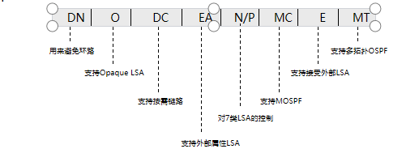  

# ISIS(ipv4)
>中间系统间路由协议，不同的网络类型，isis建立邻居的方式不同
>IS-IS协议中DIS与OSPF协议中DR（Designated Router）的区别：
>在IS-IS广播网中，优先级为0的路由器也参与DIS的选举，而在OSPF中优先级为0的路由器则不参与DR的选举。
>在IS-IS广播网中，当有新的路由器加入，并符合成为DIS的条件时，这个路由器会被选中成为新的DIS，原有的伪节点被删除。此更改会引起一组新的LSP泛洪。而在OSPF中，当一台新路由器加入后，即使它的DR优先级值最大，也不会立即成为该网段中的DR。
>在IS-IS广播网中，同一网段上的同一级别的路由器之间都会形成邻接关系，包括所有的非DIS路由器之间也会形成邻接关系。而在OSPF中，路由器只与DR和BDR建立邻接关系。
## LSP产生的原因：
IS-IS路由域内的所有路由器都会产生LSP，以下事件会触发一个新的LSP：

*  邻居Up或Down

*  IS-IS相关接口Up或Down

*  引入的IP路由发生变化

*  区域间的IP路由发生变化

*  接口被赋了新的metric值

*  周期性更新

## 收到邻居新的LSP的处理过程：
* 将接收的新的LSP合入到自己的LSDB数据库中，并标记为flooding。

* 发送新的LSP到除了收到该LSP的接口之外的接口。

* 邻居再扩散到其他邻居。

## 区域
* Level-1:只维护本地数据库，与1-2可以建立关系
* Level-2:维护本地数据库，与1-2可以建立关系，及其他Level-2
* Level-1-2∶可以同时维护Level-1和Level-2数据库
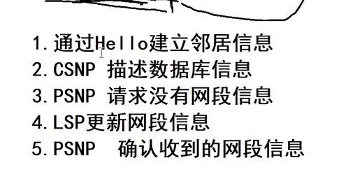
* IIH【建立关系】-CSNP - PSNP-LSP-PSNP- IIH【维护】
* ISIS-DIS:周期发送CSNP，保障MA网络LSDB同步,10s-- 【CSNP类似DBD报文】
* PSNP(用于请求和确认自己缺少的LSP)- LSR、LSAck
* 在ISIS中–设备默认接口开销值都是10
* LSPDB:最大生存时间20分钟，15分钟时候刷新-- Holdtime 从20分钟，120OS倒数LSP清除
* 0寿命生存时间:生存时间倒计时结束，LSP内容清除–保留头部–泛洪–收到置O消息，在60s从库中清除（别人始发给我，我时间到了置0，然后发给别人，别人收到后删除）
ol:过载）。
* p2p不选举DIS

## OSPF与ISIS的类比

## 扩展
* Narrow: TLV描述网络开销-【128域内路信息130外部路由信息2号邻居信息】
* 1Byte 6bit【第七位E/lI 8bit U/D Down无法传递到L2】
* wide:【135扩展开销22邻居信息】eg: cost-style wide -- isis cost 10
*  TLV: TLV1- Area IlD，TLV6- MA网络中的mac，TLV22- wide，TLV132- IP，TLV240-P2P

## 路由泄露
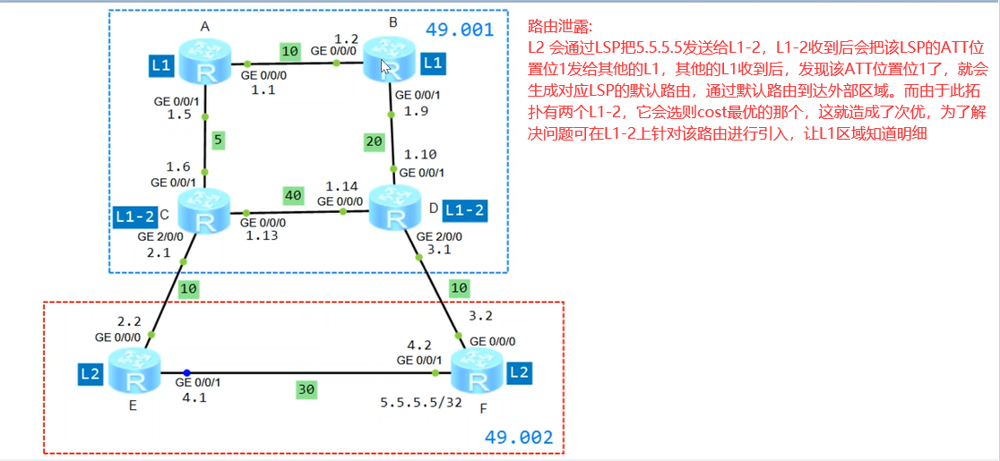
* ATT置位消息:1-2在L2有一个FUII邻居---L1收到ATT=1，会生成缺省路由次佳形成的原因:
* 1.L2通告了一个5.5.5.5/32网段--- L2 LSP send L1-2【携带Cost -dis isis lsdb level-2 verbose】
* 2.L1-2同时L2有Full邻居关系-L1ATT=1
* 3.L1生成缺省路由【Cost】--两个L1-2容易形成次佳路径【L1到达不同L1-2路径开销不同，会选择开销小的作为主路径】
* 4.L1-2设备【路由泄露-L1-2把L2路由给到L1_不足L1设备压力大;路由策略，挑选出需要加工的路由，单独渗透过去】
* 【L1通过L1/L2传递给L2_骨干设备可以了解整张拓扑---正常操作，L1/L2通过命令把L2的路由回传给L1--手工操作，路由渗透

* L2路由通过L1/L2传递给L1【路由泄露】，防止回传引发环路问题【L2的LSP，携带UP/Down】
对象【L1-2设备完成】
* 【方案一】
```
isis //进入进程
import-route isis level-2 into level-1【路由泄露】
```
* 【方案二)】
```
   ip ip-prefix 1 index 10 permit 5.5.5.5 32//捕获路由ip ip-prefix 1 index 20 permit 10.10.10.10 32//捕获路由
   isis//进入进程
      import-route isis level-2 into level-1 filter-policy ip-prefix 1//在进程里面调用
```
通过引入level-2路由的方式能够解决路由泄露，但同时也会带来环路的问题，会通过C路由器传会Level-2区域，因此，IS-IS的L1/2路由器在路由泄露中将L2区域的路由引入L1区域时，会将L2区域的明细路由使用DU比特位进行置位。
DU比特位全称为Distribution，是IP Internal Reachability TLV中每个IP路由的一个比特为，当该比特为0时，为Up状态，当该比特位为1时，为down状态。L1/2会把普通的L1路由的DU比特位置0，而把由L2区域经过路由泄露泄露到L1区域的路由的DU为置1，形成L1级别的LSP后下发。
查看DU比特位置位的情况：dis isis lsdb xxxx.xxxx.xxxx.xx-xx verbose
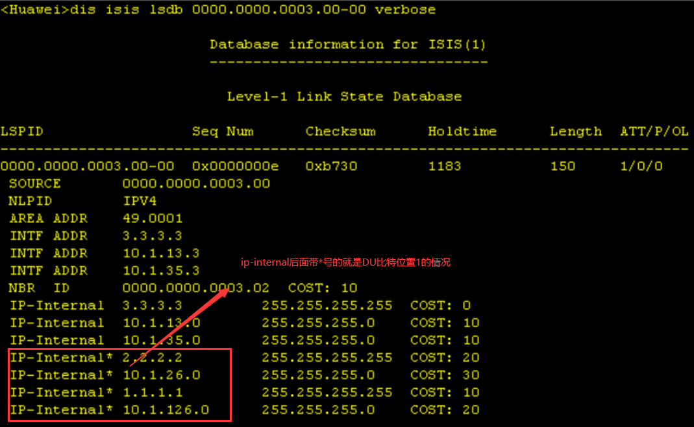
解决方法：规定L1/2路由器不会把L1区域中DU比特位为1的路由再次传递会L2区域，就解决了在引入IS-IS区域间路由泄露后的路由防环问题了。
## 快速收敛
* 初始收敛
* 故障后的收敛

## 优化

## 邻居建立失败的原因
* 1.区域ID保持一致【Level2和Level1/2不做要求】
* 2.网络实体标识唯一—
* 3.网络类型保持一致
* 4.MTU保持一致
* 5.认证一致
* 6.同一网段
* 7.进程号一致

# BGP

> 在超大型网络环境中，SPF是非常复杂的，消耗设备性能，边界网关协议BGP（Border Gateway Protocol）是一种实现自治系统AS（Autonomous System）之间的路由可达，并选择优选路由的距离矢量路由协议
> 理解:大道至简--强大属性--状态机---报文--路由控制

*  【OSPF - IP 89/RIP/ISIS/EIGRP_内部网关路由协议AS】【AS之间 BGP外部网关协议】
*  AS:自治系统【私有64512-65534 ---公有1-64511】IBGP:AS内建立BGP邻居关系
*  EBGP:AS之间建立邻居关系【TTL=1，默认直连建立邻居】
*  TCP 179:【单播】三次握手---四次挥手---跨直连建立邻居关系状态机
*  Route - refresh 路由刷新【方向- export/import】
*  AS Path: 1.AS内路由不带这个属性⒉接收到携带自己AS号路由信息，认为该路由是本AS内传播出去的，不予接受【以此防止环路】
*  origin:i>e>?【起源属性，IBGP优于EBGP 优于路由引入】


## BGP对等体之间的交互原则
BGP设备将最优路由加入BGP路由表，形成BGP路由。BGP设备与对等体建立邻居关系后，采取以下交互原则：

*  从IBGP对等体获得的BGP路由，BGP设备只发布给它的EBGP对等体。

*  从EBGP对等体获得的BGP路由，BGP设备发布给它所有EBGP和IBGP对等体。

*  当存在多条到达同一目的地址的有效路由时，BGP设备只将最优路由发布给对等体。

*  路由更新时，BGP设备只发送更新的BGP路由。

*  所有对等体发送的路由，BGP设备都会接收
  
*  从IBGP学到的路由传给EBGP的时候，会主动把下一跳改成自己的接口

## BGP状态机
&nbsp;&nbsp;&nbsp;&nbsp;&nbsp;&nbsp;&nbsp;&nbsp;&nbsp;&nbsp;&nbsp;&nbsp;&nbsp;&nbsp;&nbsp;&nbsp;&nbsp;&nbsp;&nbsp;&nbsp;&nbsp;&nbsp;&nbsp;&nbsp;&nbsp;&nbsp;&nbsp;&nbsp;&nbsp;&nbsp;&nbsp;&nbsp;&nbsp;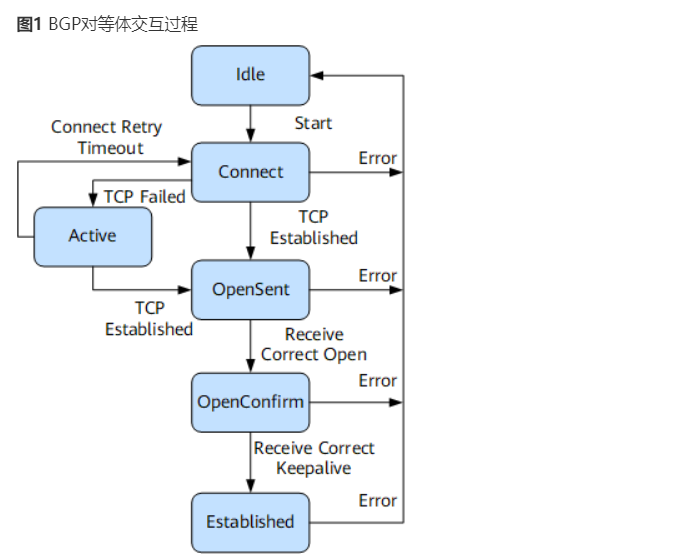

*  ldle初始状态--Connect 32S等待TCP链接--Active_-失败的连接--OpenSent协商状态--OpenConfirm等待--Establish
*  Open报文内容: Version、AS、Router-ID、Hold-time、TLV【扩展架构】--端口服务启用-认证–更新源
*  ldle状态:先进性TCP连接，源端口随机产生，目标端口TCP 179不体现BGP报文消息
*  Connect:跨直连建立邻居关系，先要保证IGP路由可达性【对端peer地址能访问】
*  增量更新: Update消息携带变更的路由信息，完成网络收敛【消除的网段，失效来定义】Path Attribute :增量可达描述消息Withdrawn:撤销不可达信息
  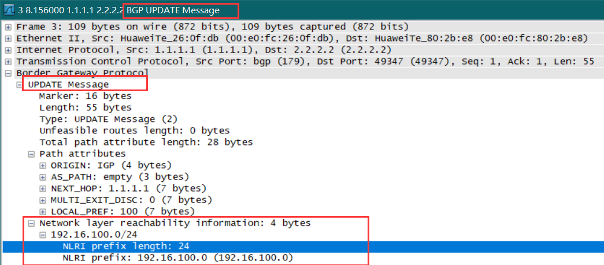
  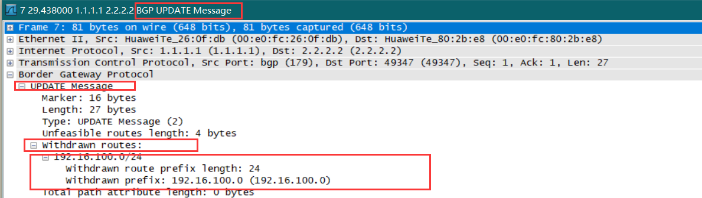
*  网络维护:Keepalive 60s为周期维护邻居关系，180S失效

## 路由生成方式
*  路由生成方式【network语句直接通告网段信息-路由引入-静态汇总-Null 发布BGP-防止环路】下一跳信息为0.0.0.0【表示本地始发】
*  刷新路由:方向【import/outport】 -入栈优选和出栈优选是两回事–软清除
*  refresh报文–触发更新消息
  

*  路由递归行为:当路由查询结果下一跳非直连的时候，会以下一跳为目标再查询路由【IBGP】
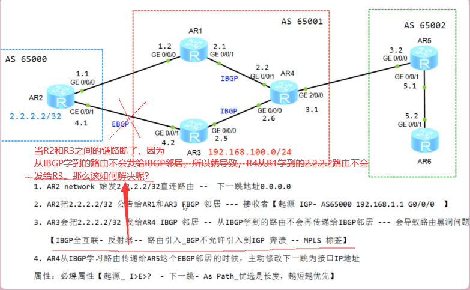

## BGP路由黑洞问题
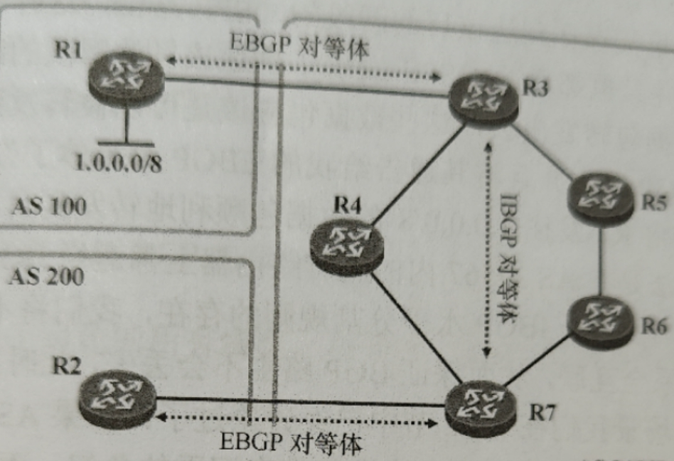

* 同步:BGP的路由让IGP保持可达【进程开启同步,BGP路由表和IGP保持相同–会引起IGP奔溃】
* 不同步:黑洞问题【强行使用缺省路由使得骨干路由器去其他AS走边界边界设备，当PE设备之间链路故障会产生环路】


## 路由汇聚导致的环路问题
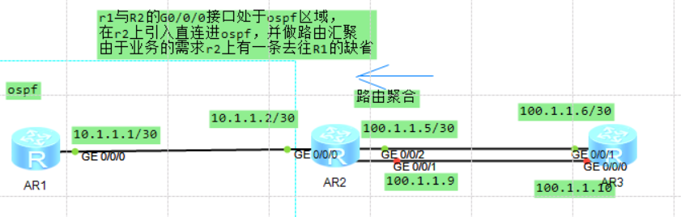
```
r2:
ip route-static 0.0.0.0 0.0.0.0 10.1.1.1
ospf 1
  asbr-summary 100.1.1.0 255.255.255.0
  import-route direct
```
实验：把r2 g0/0/2的接口down掉,在r1上tracert 100.1.1.5,如图：
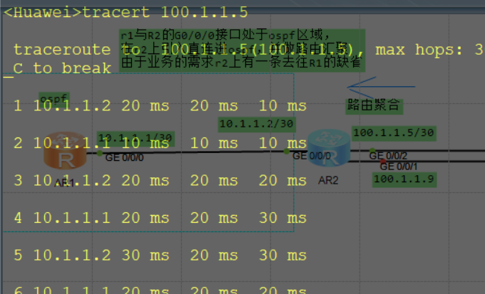
结论：会出现环路，这是由于r2的接口down了，r2依然会把聚合路由发送出去。r1收到聚合路由后，要访问100.1.1.5,通过路由表的聚合路由指导转发给r2,r2收到后，发现自己没有了去往100.1.1.5的路由，当没有路由的时候会优先按照默认路由转发，而恰好r2上有一条缺省路由，根据缺省又转发给R1，r1收到后又按照路由表的聚合路由转发给r2,如此反复----此种情况在ospf,bgp,isis等都有可能产生

解决方案：
## 属性
* 可选可传递:团体
* 必遵:起源、AS_Path、下一跳
* 可选不可传递:MED、簇列表、簇ID
* 路由的精细化控制:空间AS内AS间，集体_团体，位置_本端、对端选择不同属性实现策略、入栈、出栈--默优选原则:顺序不能乱，可选【没有反射器，不考虑簇列表长度和簇ID大小】
* BGP路由协议需要依赖IGP作为承载【Loopback可达】
*  BGP能够传递的是本地有效最佳路由【优选原则】-本地:自己始发，别人传给我在我自己数据库内部-有效:路由下一跳可达【IGP无法承载】最佳:多来源
*  Local_Preference: LP最大，默认100越大越优先【多个入口进入AS传递路由时，在AS边界修改LP属性，比较大的一端作为出口】
* Next-Hop:？？什么情况下IBGP邻居收到该路由后，会发现下一跳不可达？？？？？

*  MED:类似AS之间穿越消耗的开销，越小越优先-…多个入口进入其他AS时候，在本地修改MED值，备份链路MED【MED=200】此时会自动选择主链路默认MED 0转发

## 路由优选规则
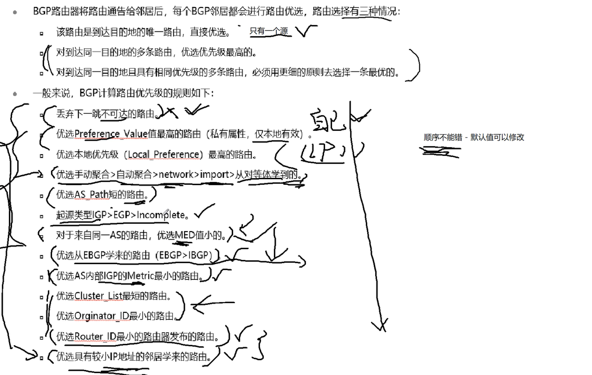

## 路由反射器


## 路由聚合 

# VRRP
>VRRP(虚拟路由冗余协议)
背景：单网关缺陷，多网关存在的问题——IP地址冲突，网关切换频繁
VRRP能够在不改变组网的情况下，将多台路由器虚拟成一个虚拟路由器
vrrp只有一种报文——通过报文，其目的地址是224.0.0.18，目的MAC地址是01-00-5e-00-0012，协议号是112，三种状态——初始(Initialize)、活动状态(Master)、备份状态(Backup)
通告报文1秒发一次，3秒老化
通过比优先级竞争master,优先级越大越优。
有两个特殊的优先级：1.0 2.255
   1.只有当master设备放弃成为master的时候优先级才会变0
   2.当接口IP与虚拟IP是一样的时候，此时的优先级为255，直接成为master
## VRRP的选举机制
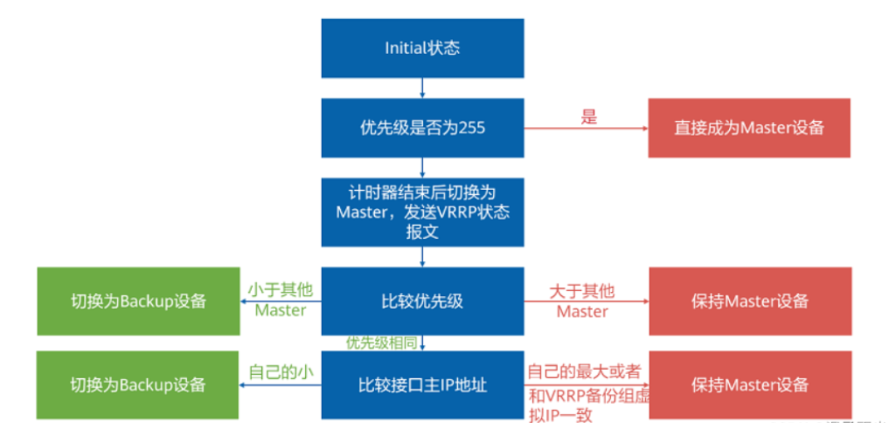

## vrrp工作原理
>VRRP的详细工作过程如下：
@ VRRP备份组中的设备根据优先级选举出Master。Master设备通过发送免费ARP报文，将虚拟MAC地址通知给与它连接的设备或者主机，从而承担报文转发任务。
@ Master设备周期性向备份组内所有Backup设备发送VRRP通告报文，通告其配置信息（优先级等）和工作状况。
@ 如果Master设备出现故障，VRRP备份组中的Backup设备将根据优先级重新选举新的Master。 @
VRRP备份组状态切换时，Master设备由一台设备切换为另外一台设备，新的Master设备会立即发送携带虚拟路由器的虚拟MAC地址和虚拟IP地址信息的免费ARP报文，刷新与它连接的设备或者主机的MAC表项，从而把用户流量引到新的Master设备上来，整个过程对用户完全透明。
@ 原Master设备故障恢复时，若该设备为IP地址拥有者（优先级为255），将直接切换至Master状态。若该设备优先级小于255，将首先切换至Backup状态，且其优先级恢复为故障前配置的优先级。
@ Backup设备的优先级高于Master设备时，由Backup设备的工作方式（抢占方式和非抢占方式）决定是否重新选举Master。

## vrrp报文

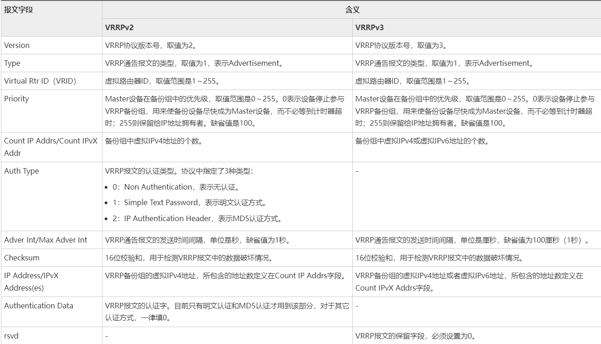


# 路由控制
>背景:1.绕总部上网【总公司买了上网行为管理，希望分公司上网的流量被总公司约束】
2.总裁办上网【Boss上网不希望被管理–策略路由】
3.备用线路非活跃流量备份【利旧】
4.生产业务中开辟新的业务线，A线路全线加密【路由策略挑选流量做服务】
5.VPN隧道加密【路由策略挑选流量入隧道做加密】  
>路由器：
   &nbsp;&nbsp;&nbsp;&nbsp;&nbsp;&nbsp;&nbsp;&nbsp;控制平面：形成和维护全局路由表   --路由策略【加工属性/过滤路由】
   &nbsp;&nbsp;&nbsp;&nbsp;&nbsp;&nbsp;&nbsp;转发平面：数据根据路由条目完成数据转发 --策略路由【强制指定下一跳】

* 路由产生的源头【多源头情况】---路由传递【传播路径–属性加工_OSPF cost/BGP优选原则】---路由接收者【选择性接受处理流量控制通常是局部的:挑选路由，完成策略

* 属性加工:路由协议特征，修改度量值–备份

* 路由过滤:使用工具–有针对性的路由删除–无备份
* Filter-Policy:针对某款协议进程本身做策略

* Route-Policy: 针对设备本身流量全局部署和策划
* 最长掩码匹配原则:1.落到这个网段 2.掩码越长越优先
* 策略路由:强制指定下一跳完成路由转发--绕过路由表手工指定下一跳【在查询路由之前完成动作】
* 拆除二层头部信息--IP包入栈处理_ACL/NAT/解密/tunnel -- 查询IPv4全局单播路由表--IlP包出栈处理 ACL/NAT/加密/tunnel --重新封装转发
* 双点双向路由引入【解决次佳路径问题】

## 解决双点双向问题
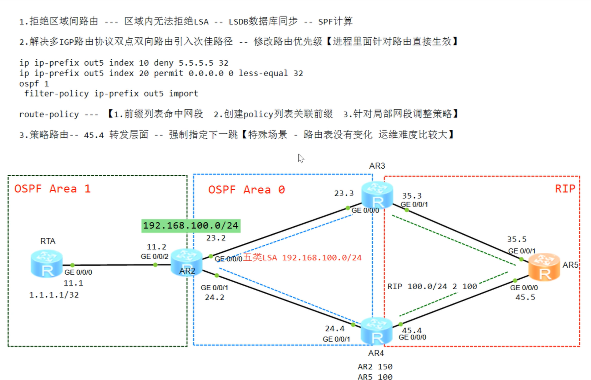


# IPV6
> IPv6地址总长度为128比特，通常分为8组，每组为4个十六进制数的形式，每组十六进制数间用冒号分隔。例如：FC00:0000:130F:0000:0000:09C0:876A:130B，这是IPv6地址的首选格式。


## IPV6地址的结构
*  一个IPv6地址可以分为如下两部分：
   * 网络前缀：n比特，相当于IPv4地址中的网络ID
   * 接口标识：128-n比特，相当于IPv4地址中的主机ID
   * IPv6单播地址示例：2001:0DB8:6101:0001:5ED9:98FF:FECA:A298/64。
  

* 接口标识有三种方法生成：手工配置、系统通过软件自动生成或IEEE EUI-64规范生成(常用，缺点：可以通过二层MAC地址推算出三层MAC)。
  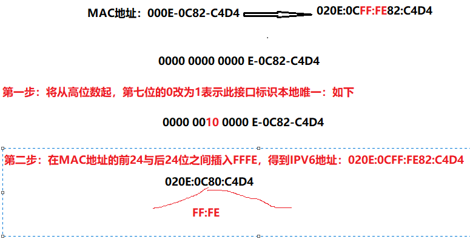


## IPV6地址的分类
==注：没有广播地址==
* IPV6单播地址
  * 未指定地址：即 0:0:0:0:0:0:0:0/128 或者::/128，表示某个接口或者节点还没有IP地址
  * 环回地址：即 0:0:0:0:0:0:0:1/128 或者::1/128
  * 全球单播地址：类似公网地址
 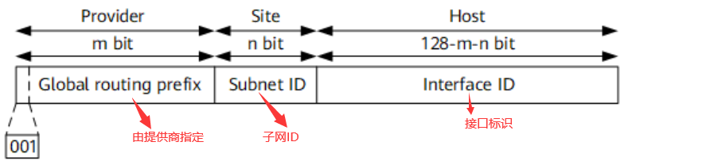
  * 链路本地地址：只能在连接到同一本地链路的节点之间使用，特定前缀:FE80::/10
  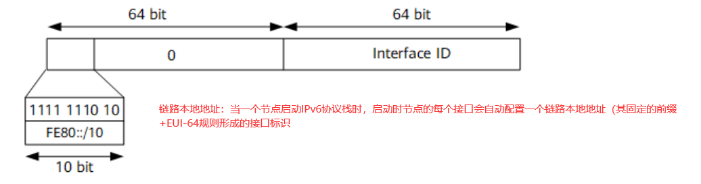
  * 唯一本地地址ULA:它仅能在一个站点内使用,只能在本地网络内部被路由转发而不会在全球网络中被路由转发.
 
* IPV6组播地址:用来标识**一组**接口
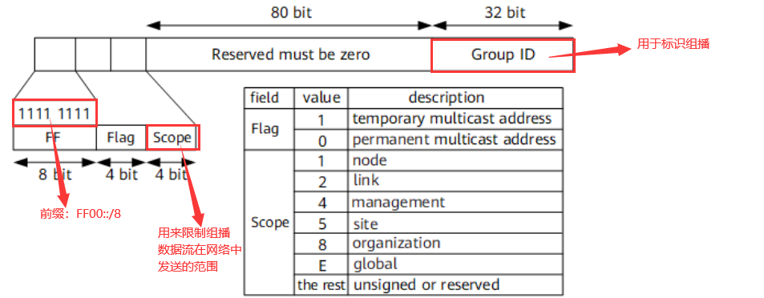
* 被请求节点组播地址：通过节点的单播或任播地址生成,前缀FF02::1:FF00:0/104
* IPV6任播地址：任播地址标识一组网络接口（通常属于不同的节点），
任播地址不是指向某个特定的主机，而是指向能够响应任播地址的 “ 最合适的 ” 或 “ 最近的 ” 那个主机


## 邻居发现(NDP)
> 邻居发现协议替代了IPv4的ARP（Address Resolution Protocol）和ICMP路由器发现（Router Discovery），它定义了使用ICMPv6报文实现地址解析，跟踪邻居状态，重复地址检测，路由器发现以及重定向等功能。

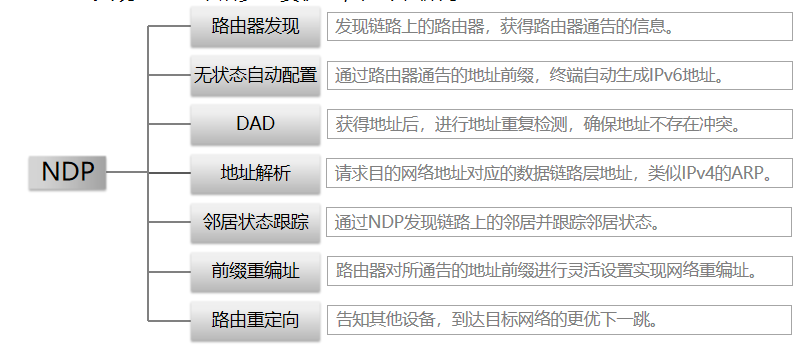


ipv6地址解析过程中使用了两种报文：邻居请求报文NS（Neighbor Solicitation）和邻居通告报文NA（Neighbor Advertisement）。

NS报文：Type字段值为135，Code字段值为0，在地址解析中的作用类似于IPv4中的ARP请求报文。
NA报文：Type字段值为136，Code字段值为0，在地址解析中的作用类似于IPv4中的ARP应答报文

## 状态机
* 5种邻居状态：Empty(邻居表项为空),Incomplete(未完成),Reachable(可达),probe(探查),Delay(延迟),Stale(陈旧)
  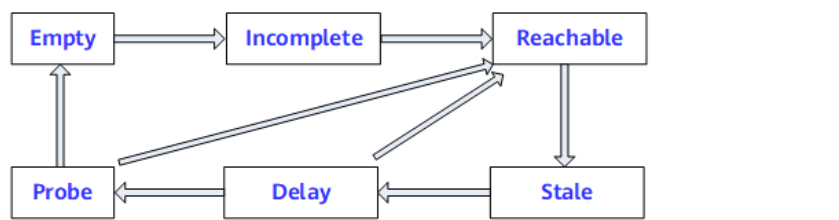
  下面以A、B两个邻居节点之间相互通信过程中A节点的邻居状态变化为例（假设A、B之前从未通信），说明邻居状态迁移的过程。

*  1.A先发送NS报文，并生成缓存条目，此时，邻居状态为Incomplete。
*  2.若B回复NA报文，则邻居状态由Incomplete变为Reachable，否则固定时间后邻居状态由Incomplete变为Empty，即删除表项。
*  3.经过邻居可达时间，邻居状态由Reachable变为Stale，即未知是否可达。
*  4.如果在Reachable状态，A收到B的非请求NA报文，且报文中携带的B的链路层地址和表项中不同，则邻居状态马上变为Stale。
*  5.在Stale状态若A要向B发送数据，则邻居状态由Stale变为Delay，并发送NS请求。
*  6.在经过一段固定时间后，邻居状态由Delay变为Probe，其间若有NA应答，则邻居状态由Delay变为Reachable。
*  7.在Probe状态，A每隔一定时间间隔发送单播NS，发送固定次数后，有应答则邻居状态变为Reachable，否则邻居状态变为Empty，即删除表项。

## 路由器发现
* 路由器通告RA（Router Advertisement）报文：每台设备为了让二层网络上的主机和设备知道自己的存在，定时都会组播发送RA报文，RA报文中会带有网络前缀信息，及其他一些标志位信息。RA报文的Type字段值为134。
* 路由器请求RS（Router Solicitation）报文：很多情况下主机接入网络后希望尽快获取网络前缀进行通信，此时主机可以立刻发送RS报文，网络上的设备将回应RA报文。RS报文的Type字段值为133。
* IPv6主机无状态自动配置过程
  * 1.根据接口标识产生链路本地地址。
  * 2.发出邻居请求，进行重复地址检测。
  * 3.如地址冲突，则停止自动配置，需要手工配置。
  * 4.如不冲突，链路本地地址生效，节点具备本地链路通信能力。
  * 5.主机会发送RS报文（或接收到设备定期发送的RA报文）。
  * 6.根据RA报文中的前缀信息和接口标识得到IPv6地址。


# OSPFv3
> OSPFv3在Hello报文、状态机、LSDB、洪泛机制和路由计算等方面的工作原理和OSPFv2保持一致。
> OSPFv3报文封装在IPv6报文内，可以采用单播和组播的形式发送


## OSPfv3报文类型
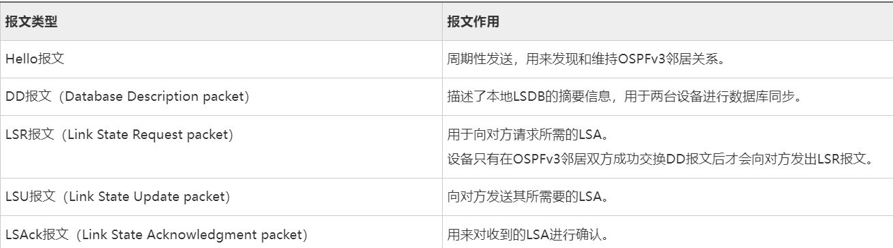


## lsa 类型
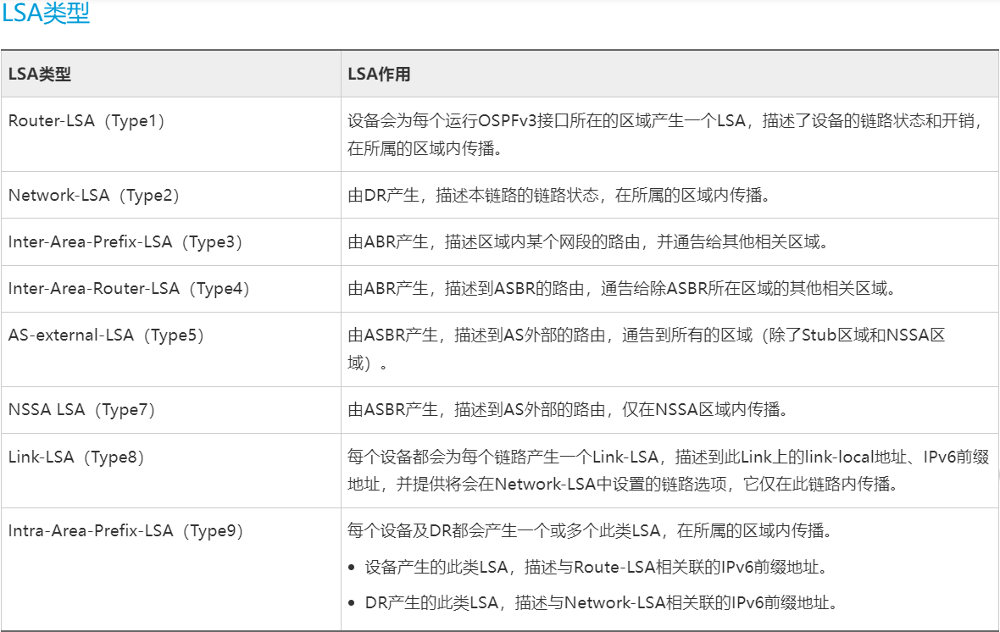

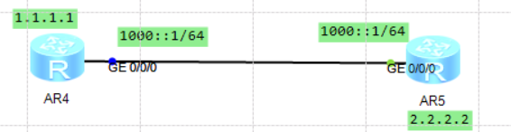


```
AR4:
int l 1
 ipv6 enable 
 ipv6 address 2000::1/128 
 ospfv3 1 area 0.0.0.0

int g0/0/0
 ospfv3 1 area 0.0.0.0

AR5:
int g0/0/1
 ospfv3 1 area 0.0.0.0
```

R4：8类LSA
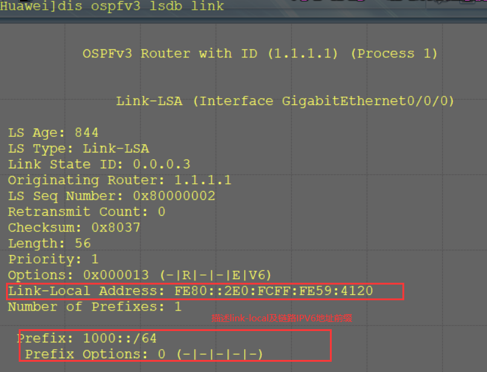
R4：9类LSA
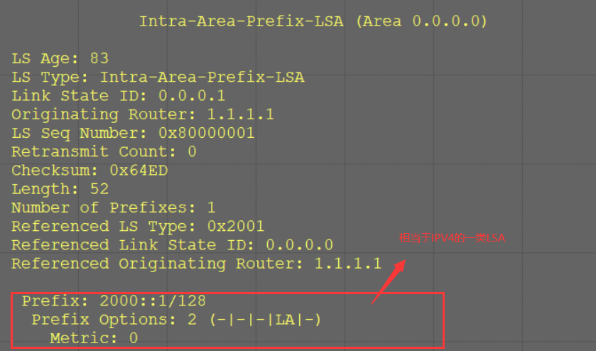
## OSPFv3和OSPFv2协议比较
* 相同点：
  * 网络类型和接口类型
  * 接口状态机和邻居状态机
  * 链路状态数据库（LSDB）
  * 洪泛机制（Flooding mechanism）
  * 相同类型的报文：Hello报文、DD报文、LSR报文、LSU报文和LSAck报文
  * 路由计算基本相同

* 不同点：
  * OSPFv3基于链路，而不是网段
  OSPFv3运行在IPv6协议上，IPv6是基于链路而不是网段的。
  这样，在配置OSPFv3时，不需要考虑是否配置在同一网段，只要在同一链路，就可以不配置IPv6全局地址而直接建立联系。
  *  OSPFv3上移除了IP地址的意义
  这样做的目的是为了使“拓扑与地址分离”。OSPFv3可以不依赖IPv6全局地址的配置来计算出OSPFv3的拓扑结构。IPv6全局地址仅用于Vlink接口及报文的转发。
  * OSPFv3的报文及LSA格式发生改变：
    * OSPFv3报文不包含IP地址。
    * OSPFv3的Router LSA和Network LSA里不包含IP地址。IP地址部分由新增的两类LSA（Link LSA和Intra Area Prefix LSA）宣告。
    * OSPFv3的Router ID、Area ID和LSA Link State ID不再表示IP地址，但仍保留IPv4地址格式。
    * 广播、NBMA及P2MP网络中，邻居不再由IP地址标识，只由Router ID标识。
* 新增两种LSA
  * Link LSA（8类）：用于路由器宣告各个链路上对应的链路本地地址及其所配置的IPv6全局地址，仅在链路内洪泛。
  * Intra Area Prefix LSA（9类）：用于向其他路由器宣告本路由器或本网络（广播网及NBMA）的IPv6全局地址信息，在区域内洪泛。
* OSPFV3移除所有认证字段（ipv6有认证）


# IS-IS V6
> 中间系统到中间系统IS-IS（Intermediate System to Intermediate System）属于内部网关协议IGP（Interior Gateway Protocol），用于自治系统内部。IS-IS也是一种链路状态协议，使用最短路径优先SPF（Shortest Path First）算法进行路由计算。

## 扩展TLV
* 236号TLV（IPv6 Reachability）：通过定义路由信息前缀、度量值等信息来说明网络的可达性。

* 232号TLV（IPv6 Interface Address）：它相当于IPv4中的“IP Interface Address”TLV 132，只不过把原来的32比特的IPv4地址改为128比特的IPv6地址。

## IS—IS多拓扑
> 从IPv4网络向IPv6网络过渡的中间过程，双栈


# MPLS
> 背景：ip转发慢，根据掩码匹配，进行与运算。即使有缓存，但当缓存超过的时候，还是需要进行掩码计算，在工程中有多个路由器，每个路由
> 器上有很多路由，要进行重复的计算
> 而MPLS是根据标签直接转发，不过因为设备的性能越来越高，mpls的优势渐渐的被抹除。现在流行是因为VPN
> 工作在“2.5”层的协议

## MPLS体系结构

## 设备类型
* 入站LER：Ingress,入节点
* 出站LER: Egress,出节点
* LSR:标签路由交换设备

## FEC(转发等价类)
> FEC可以根据源地址、目的地址、源端口、目的端口、VPN等要素进行划分

基于平台的：同一FEC，分配相同的标签值
基于接口的：在一定的情况下可以节约标签
## 标签分发与管理
* 标签的发布方式（当发布方式不一样时，邻居是能建立的，但会话是建立不起来的）
  * 自主————不需要发送请求
  * 按需————需要发送请求获得标签
* 标签的控制方式
  * 有序————按顺序来的
  * 独立————不需要按顺序，这个设备会对所有的对等体发送标签
* 标签的保留方式
  * 自由
  * 保守
当使用保守的时候，它必须是按需的，因为当一条链路断了后，它需要发送请求来获得标签，发送请求就意味着按需

## PHP
## 上有与下游
标签与数据传输的方向是相反的
## mpls标签报文
* ip的TTL值拷贝给标签报文中的TTL,4bit，防环与IP中的TTL有相同的意义
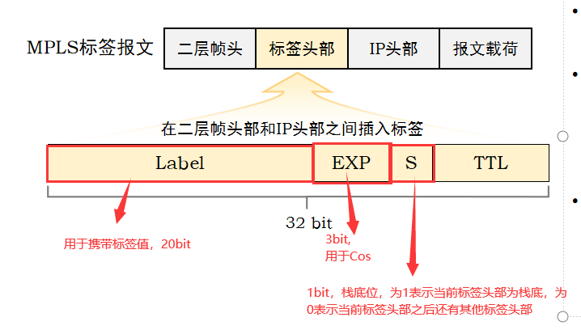

## mpls ldp 原理描述


##### 对等体
LDP对等体是指相互之间存在LDP会话、使用LDP来交换标签消息的两个LSR。LDP对等体通过它们之间的LDP会话获得对方的标签。

##### LDP邻接体
当一台LSR接收到对端发送过来的Hello消息后LDP邻接体建立。LDP邻接体存在两种类型：
* 本地邻接体（Local Adjacency）：以组播形式发送Hello消息（即链路Hello消息）发现的邻接体叫做本地邻接体。
* 远端邻接体（Remote Adjacency）：以单播形式发送Hello消息（即目标Hello消息）发现的邻接体叫做远端邻接体。

##### LDP会话
LDP会话用于LSR之间交换标签映射、释放等消息。只有存在对等体才能建立LDP会话，LDP会话分为两种类型：
* 本地LDP会话（Local LDP Session）：建立会话的两个LSR之间是直连的。
* 远端LDP会话（Remote LDP Session）：建立会话的两个LSR之间可以是直连的，也可以是非直连的。

##### LDP消息
运行LDP协议的LSR之间通过交换LDP消息来实现邻居发现、会话建立与维护以及标签管理等功能。
* 发现消息：用来宣告和维护网络中一个LSR的存在；用于通告和维护网络中LSR的存在，如Hello报文。
* 会话消息：用于建立、维护和终止LDP对等体之间的会话，如Initialization报文、Keepalive报文。
* 通告消息：用来生成、改变和删除FEC的标签映射。
* 通知消息：用来宣告告警和错误信息。
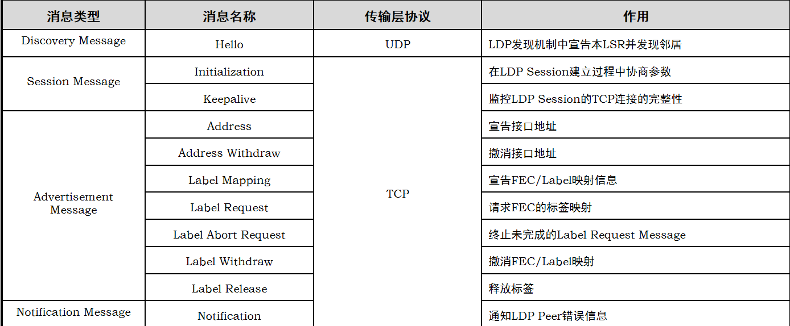
##### LDP发现机制
LDP发现机制用于LSR发现潜在的LDP对等体。LDP有两种发现机制：
  * 基本发现机制：用于发现链路上直连的LSR。
LSR通过周期性地发送LDP链路Hello消息（LDP Link Hello），实现LDP基本发现机制，建立本地LDP会话。

LDP链路Hello消息使用UDP报文，目的地址是组播地址224.0.0.2。如果LSR在特定接口接收到LDP链路Hello消息，表明该接口存在LDP对等体。
  * 扩展发现机制：用于发现链路上非直连LSR。
LSR周期性地发送LDP目标Hello消息（LDP Targeted Hello）到指定IP地址，实现LDP扩展发现机制，建立远端LDP会话。
LDP目标Hello消息使用UDP报文，目的地址是指定IP地址。如果LSR接收到LDP目标Hello消息，表明该LSR存在LDP对等体。

##### LDP会话建立的过程
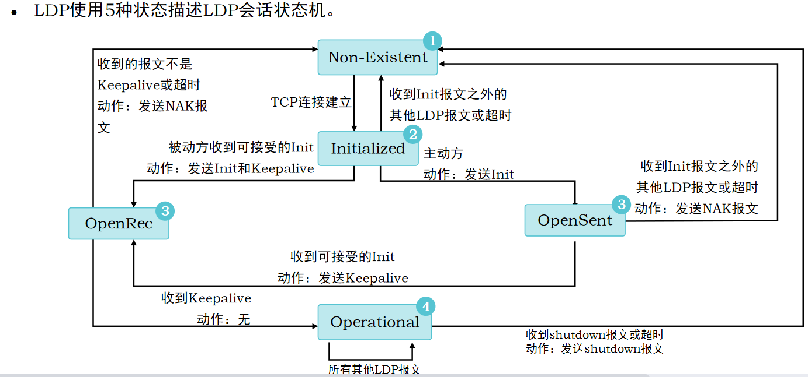


## 标签空间
> 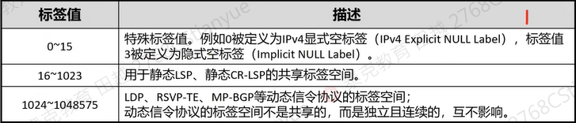

## 标签转发
tunle ID非0 查NHLFE(下一跳标签转发条目)表

查FIB
## 困扰的问题
* 为什么dis mpls lsp 会有两个相同的标签？
  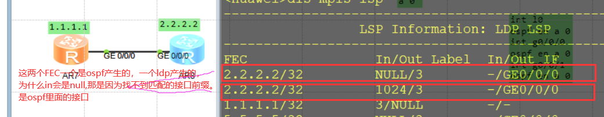
* mpls 与IGP同步？


label advertise non-null    //???


命令:
  dis mpls lsp    //数据平面的表
  dis tunnel-info tunnel-id XXX     //NHLFE表（下一跳转发表项）  控制平面表
  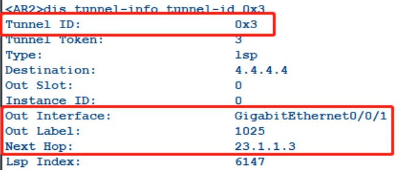
  dis mpls lsp in-label 1024 verbose  //ILM表(入标签映射表)
  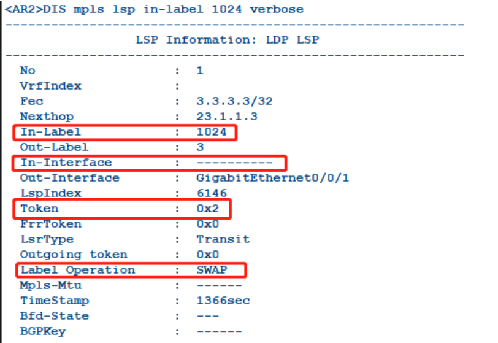

  dis mpls ldp lsp
  dis mpls ldp session 


  route recursive-lookup tunnel   //迭代进隧道

  ospf ldp-sync                   //LDP与OSPF的同步，当这个链路断了，会把cost值调成65535
  ospf timer ldp-sync hold-max-cost 100 //保持时间为100s
  ospf timer ldp-sync hold-down 100     //ospf不发包100s
  ping lsp ip XXXXX mask                //
  ttl expiration pop


# 单域MPLS-VPN
VRF：划分VRF，解决共享PE的路由冲突问题
RD值：区分不同的实例，只本地有效
RT值：通过配置RT值，接/收VPN路由
路由传递过程：RR或远端PE无法区分该相同的路由--RD-64位数
把OSPF引入到BGP的时候，MED有加1的动作

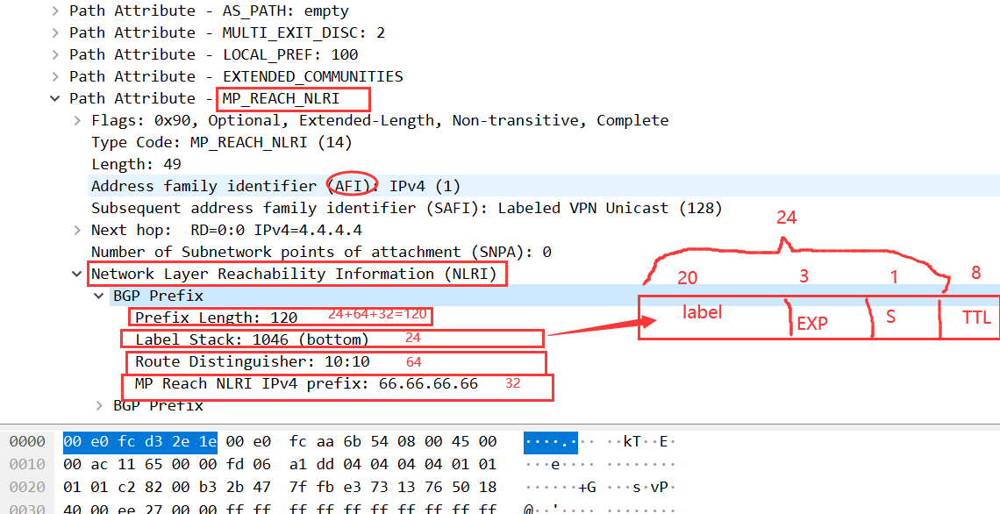
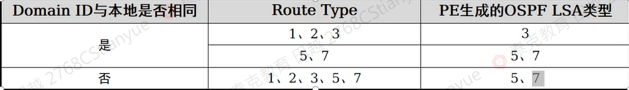


## HubSpoke结构

优点：1.总部监听分布流量2.用RR去建
缺点：1.分支互访延时大 2.总部性能要求性能高


## FUll-mesh
优点：访问延时小
缺点：


## 困扰的问题？
假设PE1、PE2分布连接的有客户1，客户2。PE1、PE2互相有对方的路由，而P设备并没有路由，当客户1访问客户2的时候，由于P设备没有对面的路由，只能通过使能隧道迭代来访问————借用MPLS迭代进隧道解决路由黑洞问题

单域VPN网络为什么从对吗学到的ospf路由显示为————区域间路由

命令：
```
import-route bgp permit-ibgp              //允许引入IBGP路由
undo ttl expiration pop                  //取消ICMP超时后响应报文沿LSP返回。 
dis bgp vpnv4 all routing-table peer 5.5.5.5 advertised-routes    //查看给5.5.5.5发布了哪些路由
undo policy vpn-target                    //不检查RT
dis bgp vpnv4 all routing-table labe      //查看远端分的标签

vpn-instance-capability simple            //破环    在MCE组网里面需要破环
dis bgp vpnv4 all routing-bable X.X.X.X   //查看携带该路由的团体属性
```


dis fib vpn-insstallA DIP mask verbose    //里面的inlabel是压入标签的意思


# sham-link详解
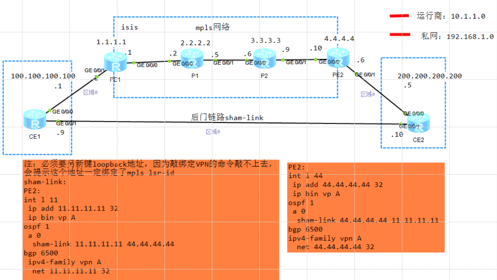


#### 建sham-link的条件
左边与右边都在同一区域
 建立sham-link的源地址必须发布到BGP里面去，不能发布到OSPF

## 问题？ 
  ==为什么两边都要在同一区域？==
  答：


  
命令：
  dis ospf sham-link


# MPLS VPN跨域

## option A方案

## option B方案

## option C方案一

# SR
## 定义
> 是基于源路由理念设计的，也就是段路由,在源规划路径
> 解决IGP与LDP同步问题，再就是控路，TLIFA
> 源节点选择一条指定的路径压入一个有序的Segment List,Segment list中有前缀节点和链路节点
> 用别人的SRGB首值+自己的index作为out标签，用自己的SRGB首值+自己的index作为in标签
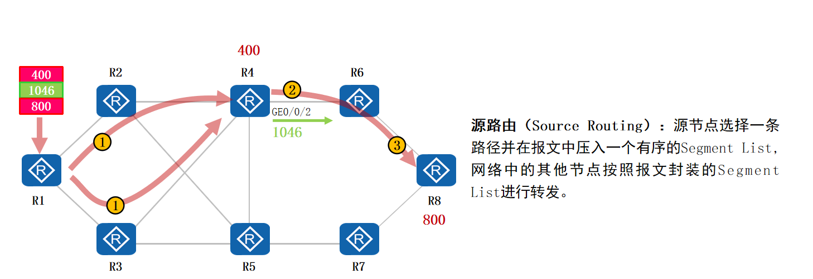
## SR的优点
* 简化MPLS网络的控制平面
  
  SR使用控制器或者IGP集中算路和分发标签，不再需要RSVP-TE，LDP等隧道协议。 
  SR可以直接应用于MPLS架构，转发平面没有变化。
 
* 高效TI-LFA FRR保护实现路径故障的快速恢复
  
  在SR技术的基础上结合RLFA（Remote Loop-free Alternate） FRR算法，形成高效的TI-LFA（Topology-Independent Loop-free Alternate） FRR算法。
  TI-LFA FRR支持任意拓扑的节点和链路保护，能够弥补传统隧道保护技术的不足。

* SR更具有网络容量扩展能力

  传统MPLS TE是一种面向连接的技术，为了维护连接状态，节点间需要发送和处理大量Keepalive报文，设备控制层面压力大。
  SR仅在头节点对报文进行标签操作即可任意控制业务路径，中间节点不需要维护路径信息，设备控制层面压力小。此外， SR技术的标签数量是：全网节点数+本地邻接数，只和网络规模相关，与隧道数量和业务规模无关。
* 更好的向SDN网络平滑演进

  SR技术基于源路由理念而设计，通过源节点即可控制数据包在网络中的转发路径。
  配合集中算路模块，即可灵活简便地实现路径控制与调整。
  SR同时支持传统网络和SDN网络，兼容现有设备，保障现有网络平滑演进到SDN网络。


## Segment分类
* Prefix Segment(前缀段)

  用于标识网络中的某个目的地址前缀
  生成方式：手工配置
  通过IGP协议扩散到其他网元，全局可见，全局有效
  Node Segment是特殊的Prefix Segment

* Adjacency Segment(邻接段)

  用于标识网络中的某个邻接
  生成方式：源节点通过协议动态分配
  通过IGP协议扩散到其他网元，全局可见，本地有效


## SRGB
* 定义：用户指定为Segment Routing Mpls 预留的全局标签集合
* 规则：每台设备通过扩展的路由协议通告自己的SRGB，各台设备根据SRGB计算入站及出站SID

## IGP协议对SR的报文扩展
* OSPF for SR-MPLS
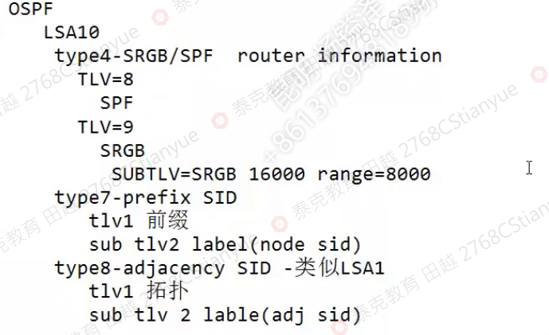
* ISIS for SR-MPLS

* BGP for SR-MPLS


## SR Policy
* 定义：一段有序的段列表，用于指导流量转发，可由本或控制器完成

## 粘连节点
* 背景：标签的深度为10，当所要的标签过多时，可通过粘连节点解决


## 关于规定转发路径
* 基于prefix Segment的转发路径：

  prefix Segment的转发路径是基于IGP的cost来选择的。
  它并不是一条固定路径，头节点无法控制报文的整条转发路径。
* 基于Adjacency Segment的转发路径：

  通过这种方式可以严格指定任意一条显式路径（Strict Explicit），可更好的配合实现SDN  
* 基于prefix + Adjacenty Segment的转发路径


# QOS
## 背景
> 随着网络的发展，网络规模及流量类型不断增加，使得网络流量不断增加，造成网络
> 拥塞，时延，掉包等。为了解决这些问题，使用QOS对流量进行管理，并实现不同的流量不同的优先级服务。

## Qos三种服务模型
* 尽力而为服务模型：网络尽最大的可能性发送报文。对网络质量不宝珠，默认使用尾丢弃
* 综合服务模型：需要预先申请特定的服务来满足需求。缺点是服务方需要维护大量的订单信息
* 区分服务模型：将网络流量分为多个类，为每个类定义相应的行为，使其拥有不同的优先转发、丢包率等

## 流分类
* 复杂流分类：五元组（源地址、源端口号、协议号、目的地址、目的端口）
* 简单流分类： IP（DSCP），8021.Q（8021p），MPLS(EXP)
  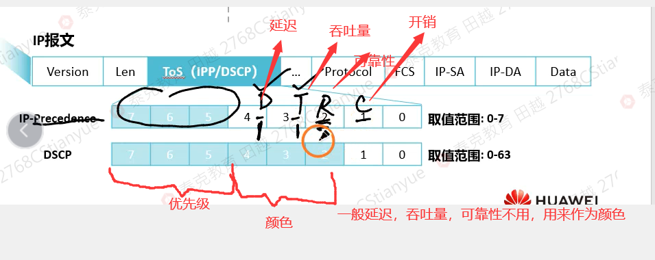

## 各外部优先级间1对应关系
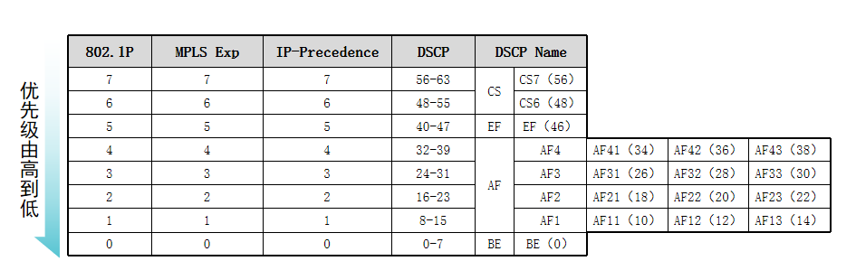

**1.AF类**
  确保转发使用前6bit位，将前6bit位分为两部分
  前3bit表示优先级，后2bit位表示丢弃概率，最后1bit固定为0
  
  AF4系列用来承载语音的信令流量
AF3系列用来承载直播视频流量
AF2系列用来承载视频点播流量
AF1系列用来承载普通文本、邮件流量
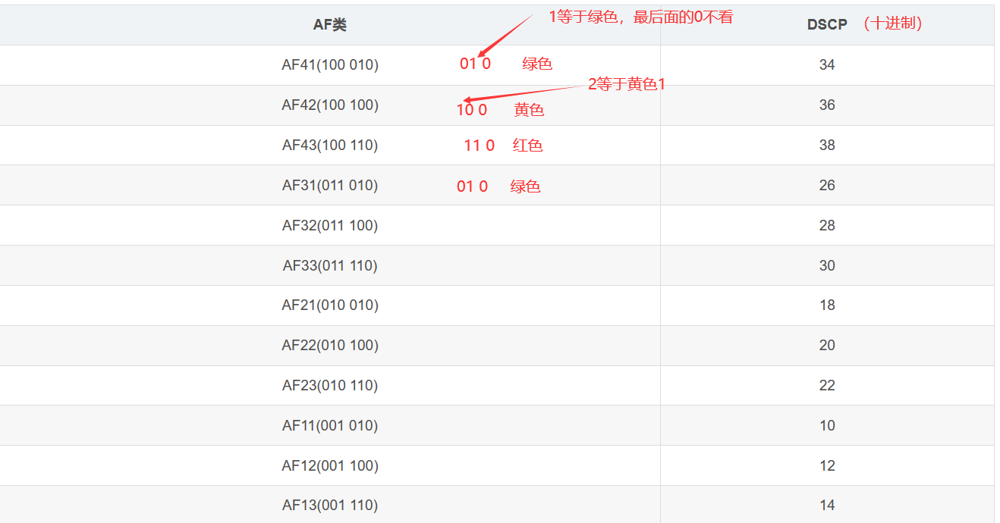

**2.CS类**
用于兼容IPP使用
后3bit位固定为0，前3bit表示优先级
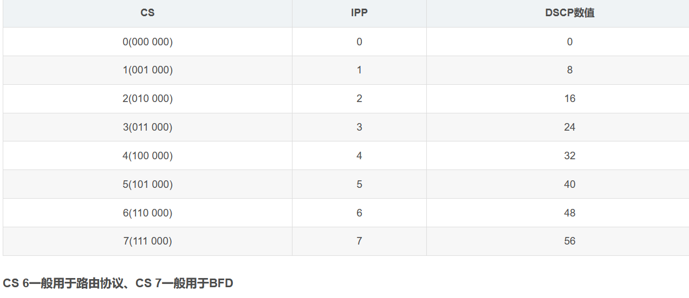

**3.EF类**
急速转发类
101 110
DSCP数值：46
承载语音流量

**4.BF类**
默认转发类
000 000
DSCP值：0


## 映射
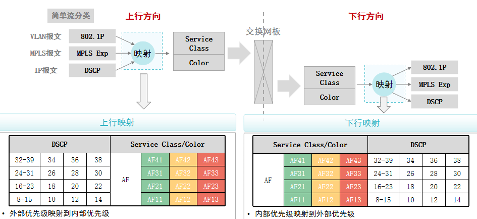

## trust 802p override命令的作用
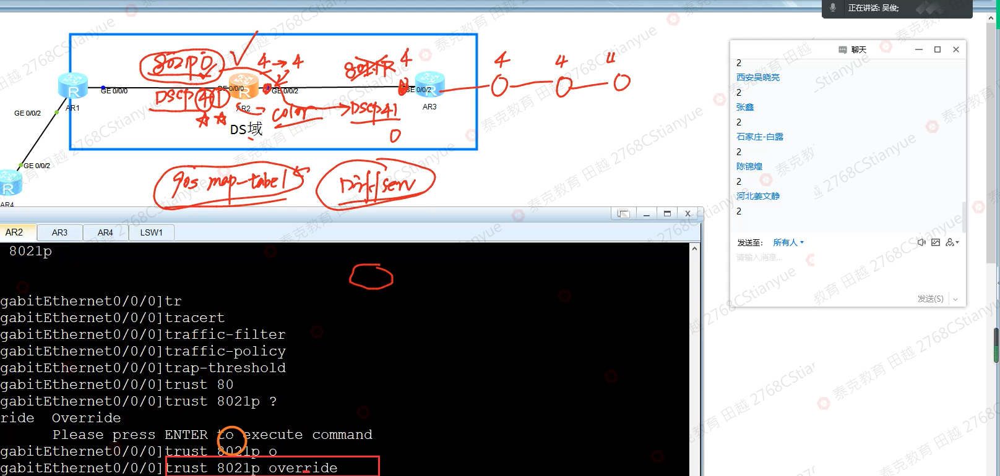
AR1到R2之间用单臂路由，数据包过了R2之后将不带有8021p,
假设后面还有设备，则后面的设备收到的包没有8021p包，将按照DSCP的优先级，但是当
在R2上敲trust 8021p override后，将会把8021P的优先级覆盖给DSCP，


## 流量限速技术
##### Qos数据处理流程
注：流量限速两种分为car(流量监管)和GTS(流量整形)
入能CAR不能GTS，出能CAR和GTS
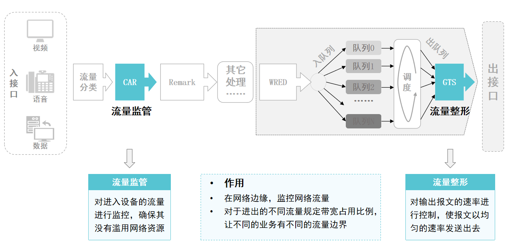
##### 令牌桶技术

* 三种令牌桶技术
  * 单桶单速双色
    * CIR:承诺信息速率，单位是kbps,即向令牌桶中投放令牌的速率
    * CBS：承诺突发尺寸，单位byte，即令牌桶的容量
    * 双色指的是红色和绿色

      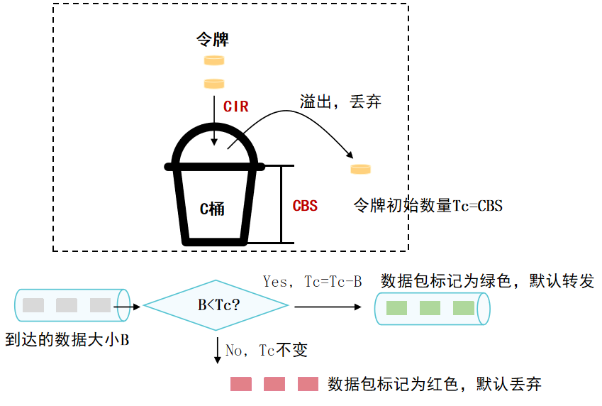
      当报文到来后，直接与桶中的令牌数相比较，如果有足够的令牌就转发（通常用一个令牌关联一个比特的转发权限），如果没有足够的令牌则丢弃或缓存。

  * 双桶单速三色
    * CIR：承诺信息速率，单位是kbps,即向令牌桶中投放令牌的速率
    * CBS：承诺突发尺寸，单位byte，即令牌桶的容量
    * EBS:峰值突发尺寸，单位byte,即所允许的最大的流量尺寸
    * 允许短暂的突发流量
    * 三色指的是红色，黄色，绿色

      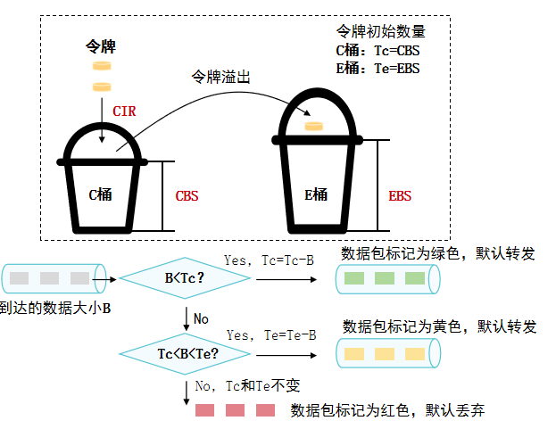
      双速率三色标记算法关注的是速率的突发，首先评估的是数据流的速率是否符合规定的突发要求，其规则是先比较P桶，再比较C桶   

  * 双桶双色（华为默认）
    * PIR：峰值信息速率。单位kbps,即向令牌桶中投放令牌的速率,大于CIR
    * PBS： 峰值突发尺寸，单位byte,即令牌桶的容量，大于CBS
    * CIR：承诺信息速率，单位是kbps,即向令牌桶中投放令牌的速率
    * 允许长期的突发流量
    * CBS：承诺突发尺寸，单位byte，即令牌桶的容量

      
      首先评估的是数据流的速率是否符合规定的突发要求，其规则是先比较P桶，再比较C桶。跟双桶双色不同
 

##### CAR(承诺访问速率)
* 特点：
  * 削峰不填谷，超过限速的数据就丢弃，丢包率比较高,抖动不会太大
  带宽的平均利用率不高，适合语音和视频的流量 
* 功能：
  * 流量速率限制
  * 流分类
* CAR处理流程：
  * 当报文到来时，首先检查端口的匹配规则，如果匹配上了，则进行速率控制，报文进入令牌桶中进行流量速率评估。
* 可使用的令牌桶类型
  * 单桶单速双色（只为了限制带宽使用这个）
  * 双桶单速三色(在限制带宽的基础上，还要对输入流量的突发情况进行区分，做不同的标记处理)
  * 双桶双色(在限制带宽的基础上，还要对输入流量的带宽情况进行区分，区分出带宽是小于CIR还是在CIR~PIR之间)

##### 流量监管的使用
* 基于接口的流量监管(在接口下配置)
* 基于类的流量监管(使用MQC的方式)
  * 配置Traffic classifier工具匹配流量
  * 配置Traffic behavior工具定义流分类的规则
  * 配置Traffic policy工具将Traffic classifier与Traffic behavior进行绑定
  * 将Traffic policy应用到设备接口上

##### GTS(通用流量整形)
* 特点：
  * 削峰填谷，超过限速的数据缓存下来，丢包率比较小，抖动会比较大，
  带宽的平均利用率比较搞，适合实时性要求不高的业务，例如FTP,EMAIL.
* 可使用的令牌桶类型：
  * 单速单桶

##### 流量整形的使用
* 基于接口配置流量整形
* 基于对垒配置流量整形
* 基于MQC配置流量整形
## 拥塞避免
> 拥塞避免是指通过监视网络资源（如队列或内存缓冲区）的使用情况，在拥塞发生或有加剧趋势时主动丢弃报文，通过调整网络的流量来解除网络过载的一种流量控制机制。
##### 拥塞的产生
* 汇聚

  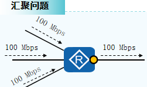

* 由高到低
  
  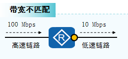 

##### 拥塞产生的影响
* 拥塞增加了报文传输的延迟和延迟抖动。
* 过高的延迟会引起报文重传。
* 拥塞使网络的有效吞吐率降低，造成网络资源的损害。
* 拥塞加剧会耗费大量的网络资源（特别是存储资源），不合理的资源分配甚至可能导致系统陷入资源死锁而崩溃

##### 拥塞避免技术
* **尾丢弃**
  * 特点：当队列的长度达到最大值后，所有新入队列的报文（缓存在队列尾部）都将被丢弃,直至拥塞解除
  * 缺点1：会造成TCP全局同步
  
    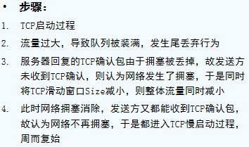
  * 缺点2：无差别丢弃，缓存在队列尾部都将丢弃，无法对流量进行区分
* **RED**
  * 特点：随机的丢弃数据报文

    
  * 缺点1：只能缓解TCP全局同步现象，通过随机地丢弃数据报文，让多个TCP连接不同时降低发送速度，从而避免了TCP的全局同步现象。
  * 缺点2：无法对流量进行区分
* **WRED**
  * 特点：WRED（加权随机先期检测）通过对不同优先级数据包或队列设置相应的丢弃策略，以实现对不同流量进行区分丢弃。

    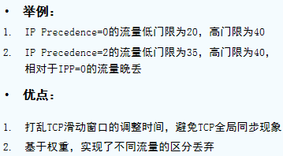

##### 拥塞避免的使用
* 基于队列的WRED
  * 配置丢弃模板
  * 配置WRED参数
  * 在队列模板中调用丢弃模板
  * 在接口出方向调用队列模板
* 基于MQC的WRED
  * 配置丢弃模板
  * 配置Traffic classifier与Traffic behavior
  * 使用Traffic policy工具将Traffic classifier与Traffic behavior进行绑定
  * 将Traffic policy应用到设备接口出方向上


## 拥塞管理技术
> 随着生活质量的提高，网络业务种类繁多，人们对网络质量的要求也越来越高，有限的带宽与超负荷的网络需求产生冲突，造成网络中时常会出现延迟、信号丢失等情况，这些都是由于拥塞产生的.拥塞管理一般采用队列技术，使用不同的调度算法来发送队列中的报文流。
> 什么是队列？
每个端口上都有8个下行队列，称为CQ（Class Queue）队列，也叫端口队列（Port-queue）
分别为BE、AF1、AF2、AF3、AF4、EF、CS6和CS7。
## 队列调度算法
* 先进先出，FIFO
  * 特点：先进的报文将先出队，后进的报文将后出队。
  * 缺点：不能有差别地对待优先级不同的报文。
* 严格优先级，SP
  * 特点：只有高优先级队列中的报文全部调度完毕后，低优先级队列才有调度机会。
  * 优点：对高优先级的报文提供了优先转发。
  * 缺点：低优先级队列可能出现“饿死”现象
* 加权公平队列，WFQ
  * 特点：按队列权重来分配每个流应占有出口的带宽
  * 优点；不同的队列获得公平的调度机会，从总体上均衡各个流的延迟。
    短报文和长报文获得公平的调度：如果不同队列间同时存在多个长报文和短报文等待发送，让短报文优先获得调度，从而在总体上减少各个流的报文间的抖动。
    从统计上看，权重越小，所分得的带宽越少。权重越大，所分得的带宽越多。
  * 缺点：低时延业务仍得不到及时调度；无法实现用户自定义分类规则。

##### PQ调度
* 高优先级优先调度，把关键业务调成高优先级，使其优先转发。当当链路一直在传输高优先级业务的时候，链路会一直优先调度这个，低优先级的得不到调度，会被饿死。


##### WRR调度（加权循环调度）
* RR的扩展，在队列之间进行轮流调度，根据每个队列的权重来调度各队列中的报文流。缺点是不公平。比如，权重7出的第一个包是100Kb，第二个包是200kb,而权重是5的出的第一个包是500kb,所以针对包的个数，包的带宽不公平


##### DRR调度
* RR的扩展，解决了WRR调度的不公平，按照包的带宽分配
  但DRR调度仍然没有解决WRR调度中低延时需求业务得不到及时调度的问题。


##### WFQ调度
* 公平队列FQ（Fair Queuing）的目的是尽可能公平地分享网络资源，使所有流的延迟和抖动达到最优：
* 不同的队列获得公平的调度机会，从总体上均衡各个流的延迟。
* 短报文和长报文获得公平的调度：如果不同队列间同时存在多个长报文和短报文等待发送，让短报文优先获得调度，从而在总体上减少各个流的报文间的抖动。
* 算法为（IP precedence+1）/Sum（IP precedence+1）


##### PQ+WRR调度


##### CBQ调度
* 基于类的加权公平队列是对WFQ功能的扩展，为用户提供了定义类的支持。CBQ首先根据IP优先级或者DSCP优先级、输入接口、IP报文的五元组等规则来对报文进行分类，然后让不同类别的报文进入不同的队列。对于不匹配任何类别的报文，送入系统定义的缺省类。
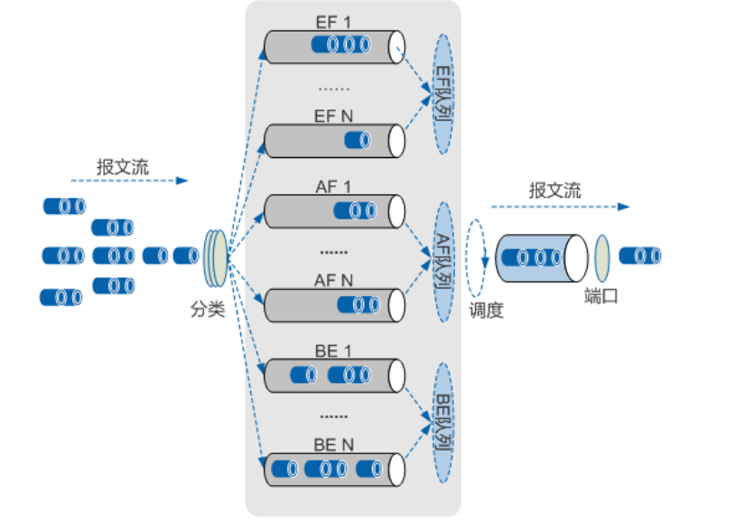
  
## 拥塞管理的应用
  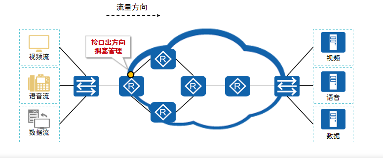

* 基于队列的拥塞管理
  * 创建QoS队列模板
  * 配置调度模式
  * 在接口下应用队列模板
* 基于MQC实现拥塞管理
  * 配置Traffic classifier与Traffic behavior
  * 使用Traffic policy工具将Traffic classifier与Traffic behavior进行绑定
  * 将Traffic policy应用到设备接口出方向上

## HQOS
* QOS的局限性：由于传统QoS只能将流分成8个队列进行调度控制，因此在多租户的场景下限制很大。
  
  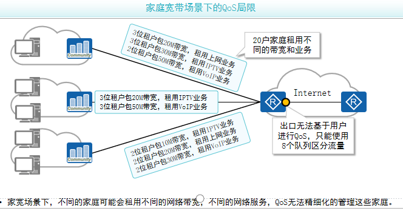
##### HQos配置
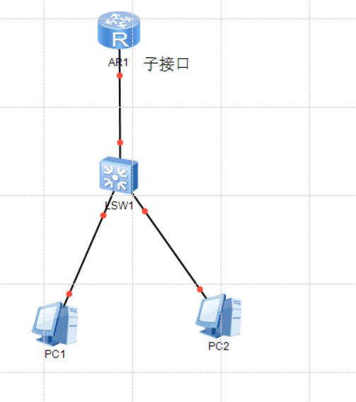
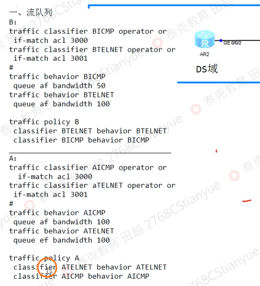
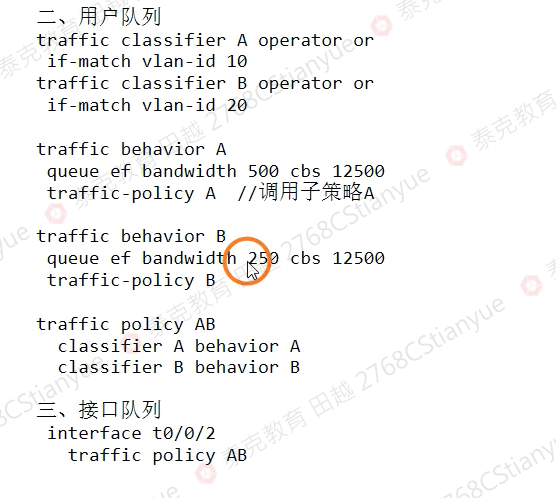
##### HQos丢弃介绍
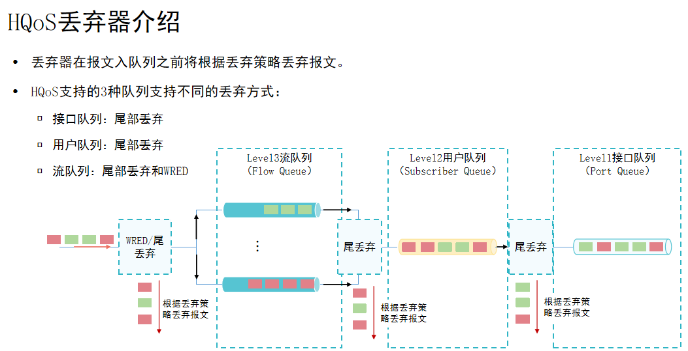
常用命令：
```
display qos car statistics interface [interface-type interface-num] [inbound | outbound]                //查看接口上通过和丢弃报文的统计信息。
display traffic classifier user-defined [ classifier-name ]                                             //查看已配置的流分类信息
display traffic behavior [ system-defined | user-defined ] [ behavior-name ]                           //查看已配置的流行为信息。
display traffic policy user-defined [ policy-name ] classifier [classifier-name ]                      //查看流策略的配置信息。
display traffic-policy applied-record [ policy-name ]                                                  //查看指定流策略的应用记录。
 display qos queue-profile [ queue-pr```ofile-name ]                                                      //查看队列模板的配置信息。
```


# VXlan园区网
> 背景：广泛用于数据中心网络，搭配园区SDN控制器实现更多的用户价值，支持在不同数据中心之间建立跨地理位置的连接，实现跨地域的虚拟机迁移和部署，虚拟机还可以在不同数据中心之间进行迁移，提高了灾备性和可用性。传统的VLAN数量有限，无法满足大规模虚拟化环境的需求。VXLAN通过引入24位的虚拟网络标识符（VNI），扩展了VLAN的数量，使得虚拟机可以在更大规模的网络中进行部署和迁移。

### VXLAN的报文格式
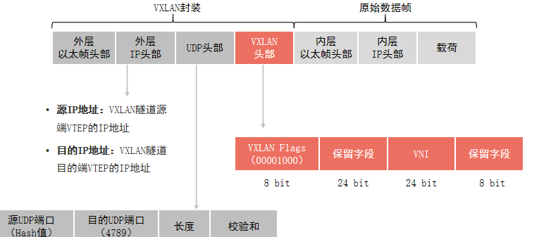