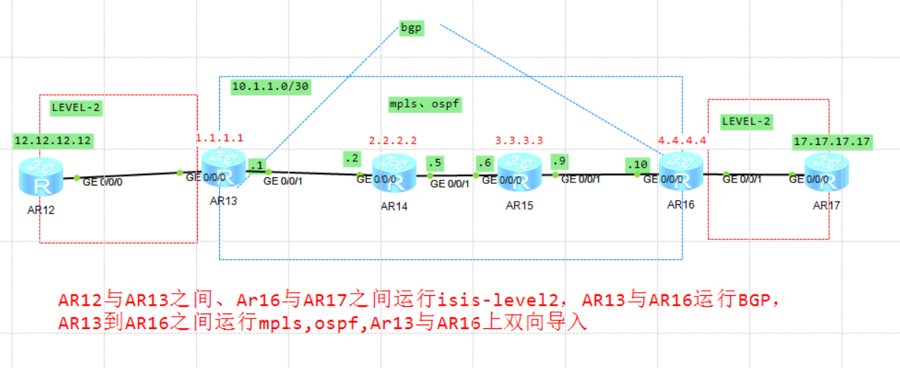
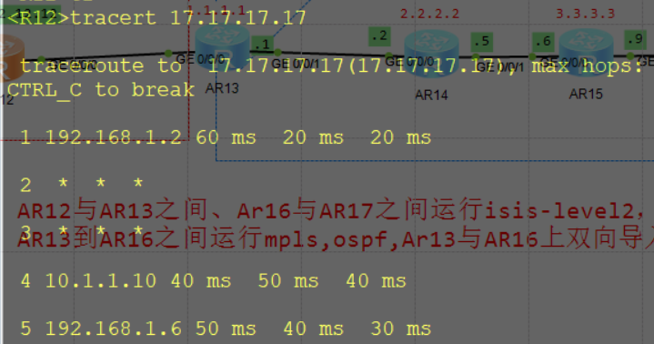

控制层面：在AR12上有17.17.17.17路由，在AR17上有12.12.12.12路由
控制层面：AR12pingAr17不通。

为什么控制层面不通？
    R12 ping R17，在数据到R13的时候，查找路由表，发现有去往17.17.17.17的路由，下一跳是R14，把数据包丢给R14，然后R14上没有17.17.17.17的路由产生路由黑洞，解决办法，迭代隧道。

解决办法：
    在R13和R16上敲route recursive-lookup tunnel，访问17.17.17.17的时候，在R13上，发现去往

迭代隧道后为什么tracert显示有*号 

