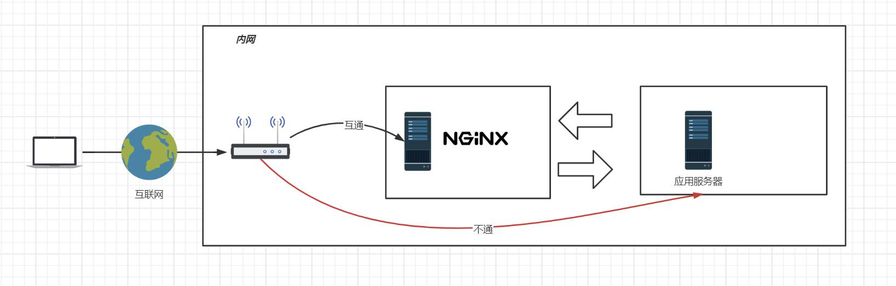
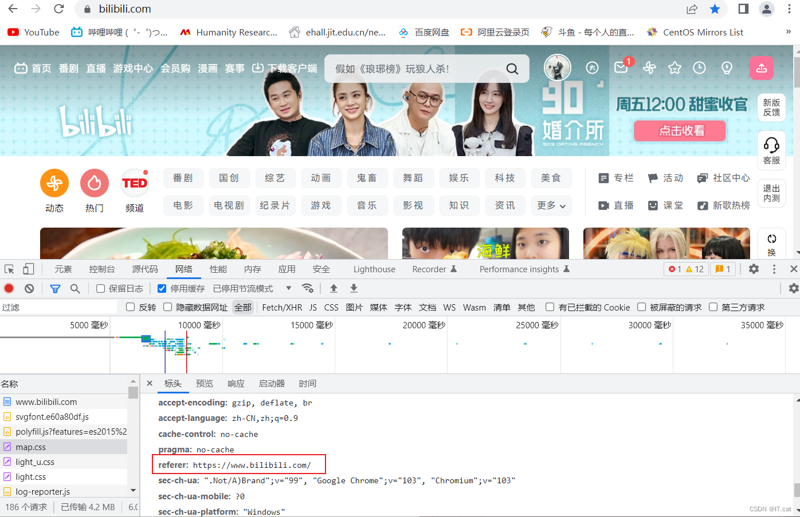

开源版    简洁，啥都没有
商业版      什么都有，可以直接用
openresty   lua脚本
Tengine     C语言，更安全，淘宝


虚拟主机原理：
    一台主机虚拟成更多的主机，让多个域名绑定到同一个IP地址上


域名解析：
    多用户二级域名
    短网址
    HTTPdns:     https://zhuanlan.zhihu.com/p/380524458(httpdns域名解析详解)


反向代理
    •网关、代理与反向代理
        用户通过网络是不能直接访问到应用服务器的(比如tomcat),只能通过nginx转发到应用服务器上，nginx和应用服务器处于内网。应用服务器再把回应发给nginx,然后再通过ngix发给用户，
        类似中间商(代理用户的请求)——————服务方反向提供代理
        隧道式代理?
        LVS(DR模型)?
    •反向代理配置(注释掉nginx要跳转的页面):
    ```
      location / {
    proxy_pass http://atguigu.com/;
    }
    ```
    •反向代理在系统架构中的应用场景
    •Nginx的反向代理配置
    •基于反向代理的负载均衡器
        轮询算法——————但无法保持会话
        restry
    •负载均衡策略




动静分离(中小型企业)
    为什么要用动静分离？


URLRewrite伪静态配置
    能够隐藏后端服务器的真实地址


防盗链
    什么是防盗链？
        防盗链简单来说就是存在我们服务中的一些资源，只有我们规定的合法的一类人才能去访问，其他人就不能去访问的资源（如css，js，img等资源）。具体点就是用户发送请求给nginx服务器，nginx服务器根据请求去寻找资源，请求的比如说是有个index.html文件，这个文件中会包含很多js，css，img等资源，这些文件在这个骨架中会被二次请求，在第二次请求时，会在请求头部上加上有个referer，这个referer只会在第二次请求时才会被加上。（referer表示第二次资源的来源地址）
        

